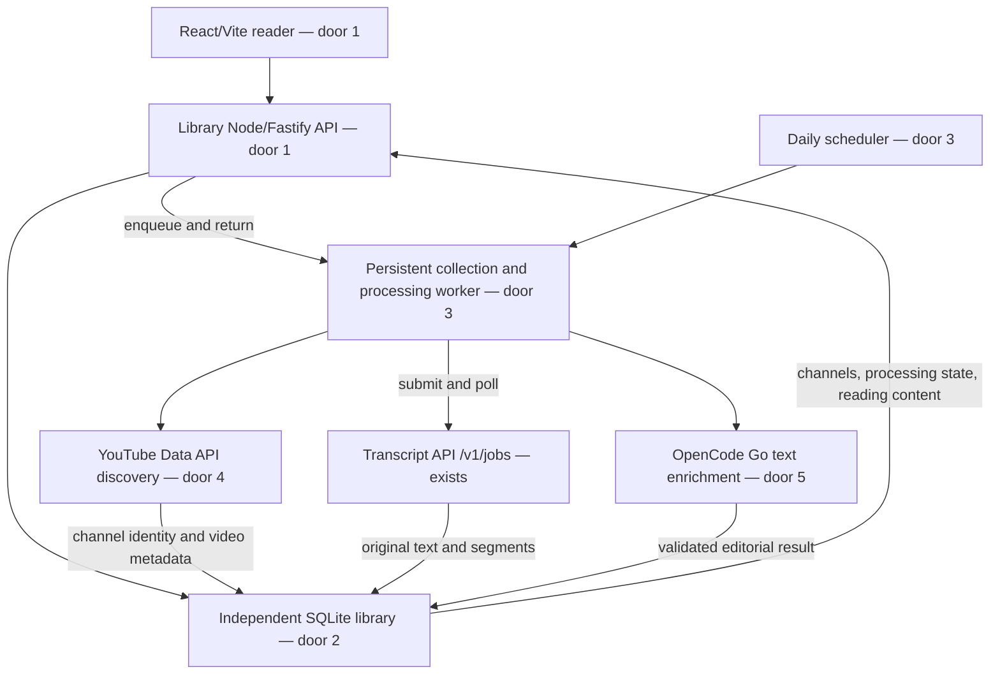
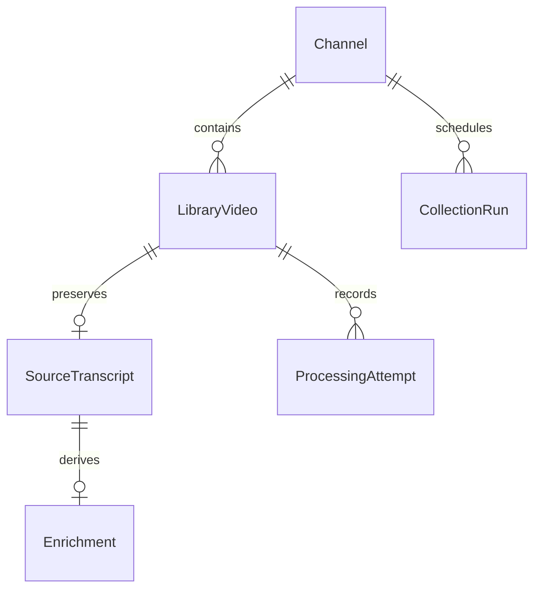

# Channel Transcript Library

Status: approved for Checks, Build, and Verify by the owner on 2026-10-01 (explicit instruction to continue until all requested work is complete).
Workflow: `tlc-spec-lean` 1.1.0. Verification profile: `light` (the undeclared-project default).
Feature base: `8310d8cf7884e77cf79ead213d4706300d6c03d6`.

## Problem

Following multiple YouTube channels currently requires the owner to find each new video,
submit it individually, and read an unedited transcript without a summary or key points.
The existing API's retained results expire, so it does not provide a permanent reading library.
The request gives no measured volume or deadline.

The owner will register channels, let daily collection populate a library, and read original
transcripts, editorial corrections, summaries, and key points in a web interface.

## Flow

Reuse the existing authenticated durable transcript HTTP API; audio extraction, captions,
PDF generation, and Muse fallback remain owned by that existing service.

The owner unlocks the reader, registers a channel, and receives its canonical identity.
Collection and enrichment happen asynchronously. The reader polls processing state and can
request collection immediately or retry a failed video. Reading already saved content does
not require an available YouTube, LLM, or transcript upstream.

## Impact

| Front | What changes |
| --- | --- |
| domain | New `Channel`: a canonical YouTube channel followed by this single-owner library. |
| domain | New `LibraryVideo`: one durable reading entry per YouTube video, independent of source-job expiry. |
| domain | New `Enrichment`: an AI-edited transcript, summary, and key points derived from an immutable source transcript. |
| domain | Existing `TranscriptJob` keeps its current meaning; the library stores its external identifier, never reads its files. |
| stored data | A new SQLite database starts empty. No migration, TTL change, or backfill of existing transcript or RAG stores. |
| existing API | Existing routes and regression tests remain valid; integration is through HTTP and a server-held Bearer credential. |
| repository | A separate application under `services/channel-library/` has API and web directories, an independent package, scripts, and configuration. Root checks gain explicit coverage of the new application. |
| language | AD-013 remains active: code, documentation, and interface copy use English; summaries and key points default to Brazilian Portuguese. Original transcript language is preserved by correction. |
| upstream fidelity | Caption and media access can fail. The existing Muse audio prompt is automotive/PT-BR-specific; this feature cannot guarantee transcription accuracy for arbitrary subjects or languages. |

## Relations

A canonical channel appears once; a YouTube video appears once globally in this single-owner
library. Each channel has at most one active collection. Each video has at most one active
processing attempt. Original content outlives upstream job expiry. Pausing a channel preserves
all previously saved content. These constraints are implemented by doors 2 and 3.

## Surface

All library JSON routes are under `/api/v1`; the existing transcript service retains `/v1`.
The library has its own owner credential. Error responses use
`{ error: { code, message }, requestId }`; internal provider bodies are excluded.
All protected routes additionally return `401` for invalid/missing credentials and `503`
when authentication or local persistence is unavailable.

| Route | In | Out | Status |
| --- | --- | --- | --- |
| `GET /health` | none | `status` | 200 |
| `GET /api/v1/channels` | none | `items` with channel identity, paused state, last collection, next collection, last error | 200, 401, 503 |
| `POST /api/v1/channels` | `url` | canonical `channel`, `collectionId` | 201, 400, 401, 404, 409, 429, 502, 503 |
| `PATCH /api/v1/channels/:channelId` | `paused` | `channel` | 200, 400, 401, 404, 503 |
| `POST /api/v1/channels/:channelId/sync` | none | `collectionId`, `status` | 202, 400, 401, 404, 409, 429, 503 |
| `GET /api/v1/videos` | optional `channelId`, `status`, `q`, `page`, `pageSize` | `items`, `page`, `pageSize`, `total` | 200, 400, 401, 503 |
| `GET /api/v1/videos/:videoId` | video identity | `video`, nullable `original`, nullable `enrichment`, `failure` | 200, 400, 401, 404, 503 |
| `POST /api/v1/videos/:videoId/retry` | none | `videoId`, `status` | 202, 400, 401, 404, 409, 429, 503 |

The browser has three views: access, channel management, and a video library with a reader.
The reader exposes Summary, Key points, Corrected transcript, and Original transcript tabs.
It links back to the source video; original segment timestamps link to the corresponding
YouTube playback time. It does not fabricate timestamps for edited prose.

## Landing

| One-way door | Literal shape | Alternative rejected |
| --- | --- | --- |
| 1. Separate application | `services/channel-library/{api,web}`; Node.js/TypeScript + Fastify API, React + Vite web; API calls `TRANSCRIPT_API_URL` with server-only `TRANSCRIPT_API_KEY`; `LIBRARY_ACCESS_KEY` is a separate owner credential. | Adding the UI and scheduler to the transcript process couples reading availability and channel collection to media processing and RAG resources. |
| 2. Independent durable library | SQLite through `better-sqlite3`, versioned migrations; `UNIQUE(channels.youtube_channel_id)` and `UNIQUE(videos.youtube_video_id)`; transactionally published originals and enrichments; `LIBRARY_DATA_DIR` is outside tracked files. | Reusing the transcript artifact directory would tie long-term reading to its TTL and private storage format. A remote database is unnecessary for the initial single-writer application. |
| 3. Persistent scheduling and deduplication | One writer process; persisted collection/attempt records; partial unique indexes on active channel collections and active video attempts; persisted daily due slot and discovery checkpoint; video states `pending`, `transcribing`, `enriching`, `retry_wait`, `ready`, `failed`, `unavailable`. | A cron callback with only an in-memory queue loses work on restart and permits overlaps with manual collection. This decision limits V1 to one library replica. |
| 4. Channel discovery boundary | `https://www.googleapis.com/youtube/v3/channels` with `forHandle`, `id`, or `forUsername`; upload-playlist enumeration through `playlistItems` and `nextPageToken`; server-only `YOUTUBE_API_KEY`. | RSS alone provides a bounded recent window and cannot support reliable paginated catch-up. Scraping channel HTML introduces another unofficial extraction surface. |
| 5. Text enrichment boundary | OpenCode Go selected by the user; `LLM_BASE_URL=https://opencode.ai/zen/go/v1`, `LLM_API_STYLE=chat_completions`, `LLM_MODEL=glm-5.3-flash` as proposed default; support `responses` style explicitly for compatible configured models; server-only `OPENCODE_API_KEY`; output `{ correctedText, summary, keyPoints }` with stored model and prompt version. | Reusing the audio-transcriber request hardcodes an audio model and a domain-specific prompt. Inferring request format from an arbitrary model name makes configuration ambiguous. |
| 6. Reading and error contract | `/api/v1` route signatures above; summaries/key points in `pt-BR`, correction in source language; originals are immutable; generated text is rendered as plain text. | Overwriting originals removes the reader's ability to check an editorial change. Rendering arbitrary model HTML creates an injection surface. |
| 7. Browser proof tooling | `@playwright/test` with Chromium, an isolated fixture API and real Vite-served React application | DOM-only simulations cannot prove viewport overflow or actual keyboard interaction. |

Doors 1–3 extend project conventions and will be recorded as active project decisions upon
plan approval; existing decisions AD-004 through AD-013 remain in force within their scopes.
No dependency version is invented here: Build resolves compatible published versions and pins them.

## Criteria

### S1: Register and manage followed channels

**Acceptance Criteria**

1. WHEN the owner submits a valid YouTube channel URL in `/@handle`, `/channel/UC…`, or `/user/name` form THEN the library SHALL persist the resolved canonical channel and return HTTP 201.
2. IF an input URL exceeds 2048 characters, names another host, contains credentials or a non-default port, or uses an unsupported path THEN the API SHALL return HTTP 400 with `INVALID_CHANNEL_URL` before an outbound request.
3. IF the channel lookup returns no channel THEN the API SHALL return HTTP 404 with `CHANNEL_NOT_FOUND`.
4. WHEN simultaneous submissions resolve to the same canonical channel THEN the library SHALL keep one channel record, with one HTTP 201 response and duplicate responses HTTP 409 `CHANNEL_EXISTS`.
5. WHEN initial collection runs THEN the library SHALL admit the ten most recent discoverable public videos, or all available videos if fewer than ten exist.
6. WHILE a channel is paused the scheduler SHALL admit zero new automatic collections for that channel.
7. WHEN the owner pauses or resumes a channel THEN the library SHALL preserve all saved videos and transcripts.

Independent demonstration: register an ID URL and handle for the same fixture channel, observe
one canonical entry, initial videos, and a reversible pause action.

### S2: Discover daily and recover interrupted work

**Acceptance Criteria**

8. WHEN an active channel reaches its daily due slot THEN the scheduler SHALL admit one collection for that slot, defaulting to 06:00 in `America/Sao_Paulo`.
9. WHEN the service starts after a missed due slot THEN the scheduler SHALL admit one catch-up collection per active channel instead of replaying every missed calendar day.
10. WHEN a collection has another upload-playlist page before its saved checkpoint THEN the worker SHALL continue pagination rather than treat the first page as a complete daily result.
11. IF discovery fails after storing a page THEN the library SHALL retain that page's videos without advancing the completed-discovery checkpoint.
12. WHEN discovery sees a previously stored video ID THEN the library SHALL retain one video record without scheduling another completed enrichment.
13. WHEN manual and scheduled collection overlap for a channel THEN the API SHALL return the existing active collection identifier without creating another active collection.
14. IF one channel's discovery fails THEN the worker SHALL continue processing other due channels and expose a sanitized error on the affected channel.
15. WHEN a restart interrupts a collection or processing attempt THEN the worker SHALL resume from its last durable stage and reuse a saved upstream job ID or source transcript.
16. WHILE video processing is active the worker SHALL execute at most one video pipeline at a time.
17. WHEN a discovery pass reaches 100 pages THEN the worker SHALL persist continuation state for a later pass rather than declare discovery complete.

Discovery revisits a seven-day overlap around the completed publication checkpoint and deduplicates
by video ID. The checkpoint advances only after the relevant scan completes. Initial collection
records its start cutoff so publications arriving during setup remain eligible. Full enumeration
of arbitrarily old videos that become public later is outside the daily-new-publications contract.
Overlapping collection joins return HTTP 202; a paused channel returns HTTP 409 for manual sync.

Independent demonstration: advance an injected clock, serve more than one page of new videos,
interrupt the process between pages, restart, and observe one persisted entry per video.

### S3: Obtain transcripts and publish editorial results

**Acceptance Criteria**

18. WHEN a video needs its original transcript THEN the worker SHALL use authenticated `POST /v1/jobs`, poll the returned job, and retrieve the completed transcript over HTTP.
19. WHEN the worker retrieves a completed source THEN the library SHALL persist the complete original text, segments, source, language, and timestamp precision before requesting enrichment.
20. WHEN the source service later expires that job THEN the library SHALL continue serving its saved original and editorial result.
21. IF the source reports `VIDEO_NOT_AVAILABLE` THEN the library SHALL expose `unavailable` without requesting enrichment.
22. IF a provider returns a timeout, HTTP 429, or HTTP 5xx THEN the worker SHALL schedule at most three attempts per stage using persisted retry times, honoring `Retry-After` up to one hour or delays of 60 and 300 seconds when absent.
23. IF a provider rejects credentials or quota without a retryable response THEN the worker SHALL expose a terminal actionable error without a retry loop.
24. WHEN source polling exceeds six hours for an attempt THEN the library SHALL expose `TRANSCRIPT_JOB_TIMEOUT` and retain its upstream job ID for an owner-requested retry.
25. WHEN enrichment completes THEN the library SHALL publish only a nonempty corrected transcript, nonempty summary, and one to ten nonempty key points as one atomic result.
26. WHEN the worker asks the LLM for correction THEN its instruction SHALL restrict editing to punctuation, spelling, paragraphing, and evident transcription errors while preserving names, quantities, meaning, and source language.
27. WHEN the worker asks the LLM for a summary and key points THEN its instruction SHALL request Brazilian Portuguese grounded only in the supplied transcript.
28. IF a transcript exceeds 12000 Unicode code points THEN the worker SHALL process ordered chunks of at most 12000 code points and reduce their summaries without dropping source chunks.
29. IF a source exceeds 1000000 Unicode code points THEN the library SHALL retain the original and expose `TRANSCRIPT_TOO_LARGE` without an LLM request.
30. IF an LLM response is malformed, empty, truncated, or missing a required output field THEN the library SHALL withhold the incomplete enrichment and expose `INVALID_LLM_RESPONSE`.
31. WHEN the owner retries a failed enrichment with a saved original THEN the worker SHALL reuse the original without resubmitting transcription.
32. WHEN an enrichment becomes ready THEN the library SHALL retain the model identifier, prompt version, and completion time alongside that result.
33. IF an outbound discovery request exceeds 30 seconds or an LLM request exceeds 120 seconds THEN the worker SHALL abort that request and record a timeout for the applicable retry policy.
34. WHEN transcript or model content contains HTML or instructions THEN the reader SHALL display it as text without executing markup or following embedded instructions as application commands.

Correction is an editorial aid, not a factual-accuracy guarantee. Chunk-level progress persists;
intermediate summaries are recursively reduced in bounded inputs. A provider call that succeeds
immediately before a local crash can be repeated: local deduplication does not promise exactly-once
upstream billing. Source polling uses a two-second minimum and honors longer retry hints.

Independent demonstration: complete a video against controlled HTTP providers, fail enrichment,
restart, retry from the saved source, and inspect the full original and validated result.

### S4: Read and operate the library in the browser

**Acceptance Criteria**

35. WHEN the owner opens the channel view THEN the interface SHALL show channel name, collection state, last collection time, next collection time, and pause/resume plus collect-now actions.
36. WHEN the owner opens the video library THEN the interface SHALL show title, channel, publication date, thumbnail when available, and processing status ordered by publication time descending and video ID as tie-breaker.
37. WHEN the owner filters videos THEN the API SHALL apply channel, processing-state, and case-insensitive title search filters with page size 20 by default and a maximum of 100.
38. WHEN the owner opens a ready video THEN the reader SHALL provide Summary, Key points, Corrected transcript, and Original transcript tabs containing the corresponding saved content.
39. WHEN the owner selects an original segment timestamp THEN the reader SHALL open that video at the segment's start time without representing edited prose as time-aligned captions.
40. WHEN a channel or video collection is empty THEN its view SHALL show an empty-state message and a channel-registration action or a clear-filters action as applicable.
41. WHILE a channel list, video list, or reader request is pending the relevant view SHALL expose a loading state.
42. IF a channel list, video list, or reader request fails THEN the relevant view SHALL show an error and a retry action without replacing previously loaded content with fabricated results.
43. IF a protected request returns HTTP 401 THEN the interface SHALL return to the access view and discard its in-memory owner credential.
44. WHEN a video is processing, unavailable, or failed THEN the reader SHALL show its state and any saved original; failed or unavailable entries expose an owner-requested retry action.
45. WHEN the reader renders at viewport widths of 360 and 1280 pixels THEN its tabs, content, and primary actions SHALL remain accessible without document-level horizontal scrolling.
46. WHEN a keyboard user navigates the reader THEN the interface SHALL provide labeled inputs, visible focus, and operable tabs and actions.

Independent demonstration: use populated and empty fixtures, delayed/failed requests, a rejected
credential, a long transcript, and both viewport widths through a real browser.

### S5: Protect credentials and keep operations reproducible

**Acceptance Criteria**

47. IF a protected library request lacks a valid owner Bearer credential THEN the API SHALL return HTTP 401 without reading library content or admitting work.
48. IF `LIBRARY_ACCESS_KEY` is absent THEN protected library routes SHALL return HTTP 503 rather than become public.
49. The web build SHALL contain no transcript-service credential, YouTube API key, or OpenCode API key; the entered library credential remains in browser memory only.
50. WHEN a mutating admission route receives more than 30 requests in one minute from an authenticated owner THEN the API SHALL return HTTP 429 with `Retry-After`.
51. WHEN a route fails THEN the library SHALL return the documented error envelope with a stable code and sanitized message rather than provider response bodies.
52. WHEN the worker records an operational event THEN its log SHALL include stage, outcome, and elapsed time without credentials, URLs, video IDs, transcript content, or provider bodies, preserving AD-009.
53. WHEN upstream credentials or required URLs are unconfigured THEN affected actions SHALL report `CONFIGURATION_REQUIRED` while already saved content remains readable.
54. The repository SHALL document independent API/web startup, required environment variables, persisted storage, daily scheduling, and the requirement for an always-running worker.
55. The existing transcript API SHALL retain its current HTTP signatures and pass its existing regression checks after the library application is added.

Independent demonstration: run the documented local setup and root checks, exercise authentication
and rate limits, inspect the generated frontend bundle, and read saved content with upstreams offline.

## Out of scope

| Excluded | Why |
| --- | --- |
| Full channel-history import | The owner selected ten recent videos plus subsequent publications. |
| Multiple owners, account registration, roles, or OAuth channel access | The requested first service is a single-owner library of public videos. |
| Guaranteed access to private, removed, restricted, or blocked videos | The existing API and YouTube access constraints remain authoritative. |
| Legacy `/c/name` resolution | The first release accepts canonical IDs, handles, and legacy `/user/name` links; unsupported links receive guidance to use the channel's handle URL. |
| Generalizing the existing Muse audio prompt | This is an existing upstream quality limitation; changing the transcription service is separate from building its consumer. |
| Library RAG/chat, semantic search, PDF exports, notifications | These are additional product capabilities beyond channel collection and reading. |
| Deleting channels or saved videos from the UI | Reversible pause covers stopping collection without introducing a data-loss flow. |
| Multi-replica processing or automatic deployment | V1 uses a persistent single-writer process; hosting changes require their own concrete deployment work. |

## Assumptions

| Assumption | Chosen default | Rationale | Confirmed? |
| --- | --- | --- | --- |
| Text provider | OpenCode Go with configurable model | The owner explicitly selected this provider during planning. | y |
| Model configuration | `glm-5.3-flash` with the documented chat-completions endpoint; operator may configure a Responses model and matching API style | Provides a concrete text-oriented default without coupling enrichment to the audio model. | n |
| Discovery credentials | Add a server-only YouTube Data API key | Channel identity and paginated upload enumeration need a documented discovery source. | n |
| Long-term retention | Keep library data until the operator removes its independent data directory after taking a backup | Reading should not inherit the upstream seven-day artifact expiry; storage capacity remains an operator concern. | n |
| Collection overlap | Rescan a seven-day publication overlap | Reduces gaps from delayed visibility while keeping ordinary daily scans bounded. | n |
| Deployment topology | Local development first; one library worker with a persistent writable directory and same-origin frontend/API in a hosted build | Follows the repository's single-writer precedent and avoids browser cross-origin credentials. | n |
| Verification depth | `light`, default budget 150k | No project declaration overrides the skill default; an independent Verifier is still required after implementation. | n |

**Open questions:** only the go-live configuration below; product preferences asked during this turn are resolved.

| # | Kind | Question | Until answered |
| --- | --- | --- | --- |
| 1 | blocks go-live | Supply a valid YouTube Data API key, transcript service URL/credential, library owner key, and OpenCode key/model configuration through local environment settings. | Build and deterministic checks can use fixtures; live collection cannot be claimed without configured providers and a real smoke run. |

## Observable

| Surface | Decision | Landing |
| --- | --- | --- |
| Access screen | unauthorized and missing configuration | AC 43, 47, 48, 53 |
| Access screen | empty, loading, error | Empty credential prompts entry; loading/error behavior follows AC 41–43. |
| Access screen | density and ordering | One labeled owner-token field and unlock action; AC 46. |
| Channels screen | empty | AC 40 |
| Channels screen | loading | AC 41 |
| Channels screen | error | AC 42 |
| Channels screen | unauthorized | AC 43 |
| Channels screen | density and ordering | Compact channel list ordered by name and canonical ID; fields/actions in AC 35. |
| Video library | empty | AC 40 |
| Video library | loading | AC 41 |
| Video library | error | AC 42 |
| Video library | unauthorized | AC 43 |
| Video library | density, ordering, duplicates | Responsive cards with AC 12, 36, 37, 45. |
| Reader | empty or unavailable content | AC 44; missing video displays HTTP 404 as an error with return-to-library action. |
| Reader | loading | AC 41 |
| Reader | error | AC 42, 44 |
| Reader | unauthorized | AC 43 |
| Reader | density, ordering | One reading column and ordered tabs; AC 38, 39, 45, 46. |
| All screens | destructive confirmations | n/a - no deletion or destructive content replacement is exposed. |
| Library API | success shape and statuses | Surface route table; AC 1–4, 13, 37, 47–51. |
| Library API | error shape and codes | AC 2, 3, 21, 23, 24, 29, 30, 51, 53. |
| Library API | callers and secrets | AC 47–49; one owner, server-held provider credentials. |
| Library API | versioning | Door 6 and `/api/v1` Surface signatures. |
| Library API | admission rate limit | AC 50; read polling does not consume expensive-work admission quota. |
| Daily worker | output and partial failure | AC 11, 14, 22–24, 30, 52; persisted status and bounded structured events. |
| Daily worker | flags and defaults | No command flags; environment defaults: 06:00, `America/Sao_Paulo`, concurrency 1, limits in AC 17, 28, 29, 33. |
| Daily worker | exit behavior | Startup with invalid local configuration exits 1; clean shutdown exits 0 after checkpointing; isolated provider failures remain persisted and do not exit the service. |
| Setup documentation | structure, tone, depth, next action | AC 54; English prerequisites, environment table, startup commands, recovery notes, then a channel-registration walkthrough. |
| Reading collection | grouping, names, ordering, duplicates, exception | AC 12, 35–39, 44; channel grouping, original video titles, newest first, explicit unavailable state. |

All nine implicit dimensions were considered while deriving criteria: validation/bounds
(2, 17, 28–30, 33, 37), partial failure (11, 14, 19, 25), idempotency/retry (4, 12, 13, 15,
22, 31), authorization/limits (47–50), concurrency/ordering (4, 13, 16, 28, 36), lifecycle
(7, 19, 20), external failure (21–24, 30, 33, 53), state transitions (15, 18–25, 31, 44),
and observability (35, 44, 51, 52). The proof join belongs in `checks.md` after review.

## Sources

- The owner's request, explicit OpenCode Go selection, and selection of ten recent videos plus new publications in this conversation are the product authority.
- Existing constraints: `.specs/STATE.md` AD-004–AD-013 and `src/http/job-routes.ts` / `src/domain/job.ts` / `src/domain/transcript.ts` define the reused transcript contract; `src/infrastructure/audio/muse-audio-transcriber.ts` exposes the current audio-prompt limitation.
- Discovery contract: [YouTube channels.list](https://developers.google.com/youtube/v3/docs/channels/list) and [playlistItems.list](https://developers.google.com/youtube/v3/docs/playlistItems/list); text provider configuration: [OpenCode Go](https://dev.opencode.ai/docs/go/), checked 2026-10-01.
