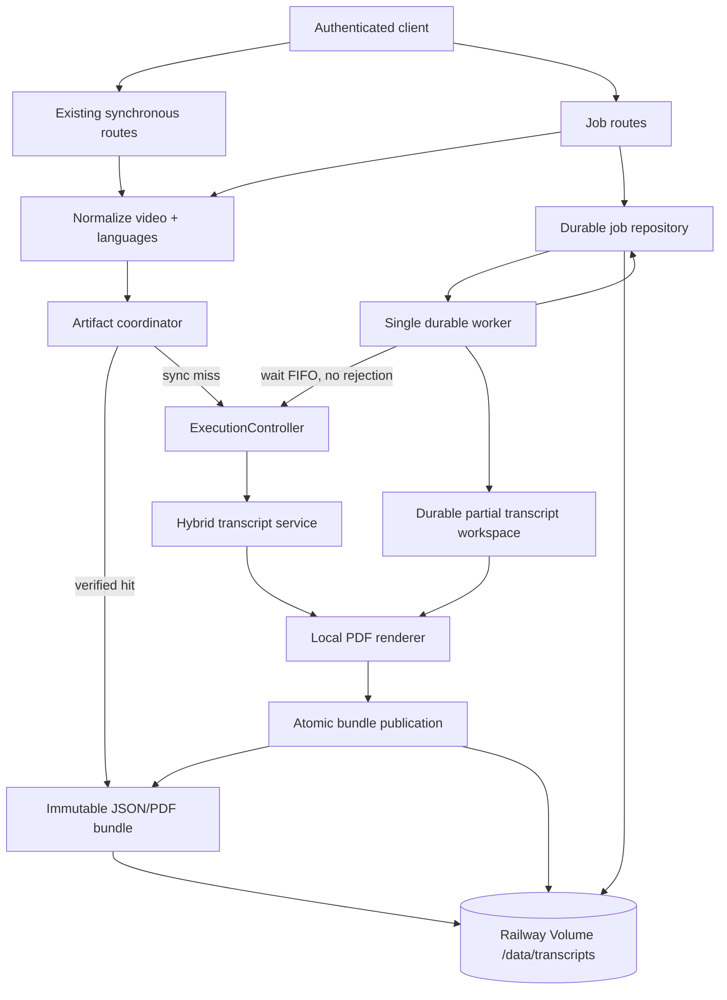
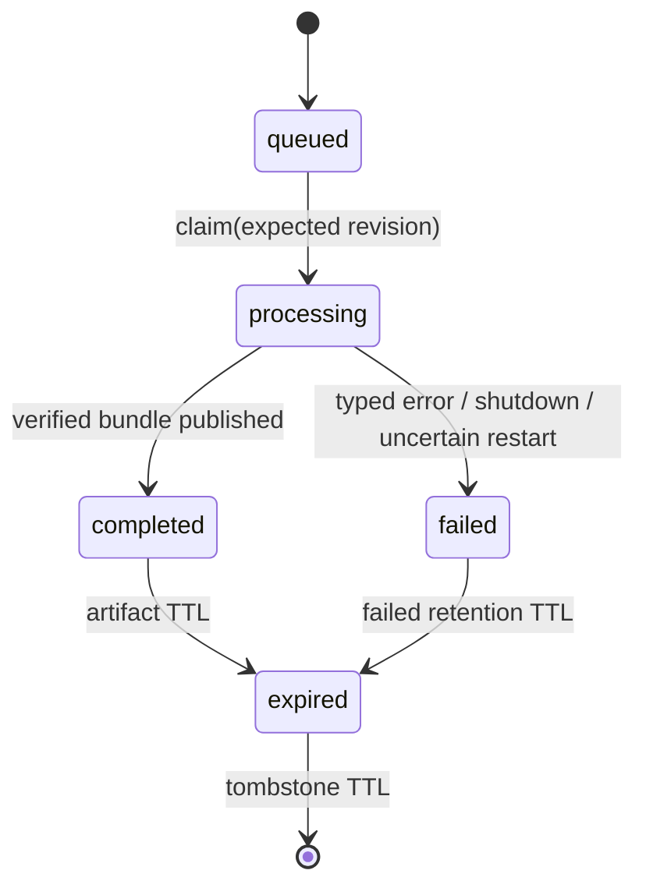

# Durable Transcript Jobs and Artifact Cache Design

**Spec**: `.specs/features/durable-transcript-jobs/spec.md`
**Context**: `.specs/features/durable-transcript-jobs/context.md`
**Status**: Approved by user on 2026-08-26

---

## Chosen Architecture

Use one in-process durable worker, an application-owned atomic file repository, and immutable
JSON/PDF bundles on the single Railway Volume. A guarded in-memory index accelerates access, but
every authoritative state transition is persisted before it becomes visible. The existing
`ExecutionController` owns both synchronous and worker capacity.

This is the approach approved by the specification. It avoids another paid service and native
database dependency while preserving explicit crash semantics.

| Approach | Strengths | Costs / risks | Decision |
| -------- | --------- | ------------- | -------- |
| Atomic file repository + immutable bundles | No new service/API spend; no native dependency; simple backup surface; natural fit for LanceDB on the same Volume | Single writer/replica; application owns validation, revisions, and recovery | **Chosen** |
| SQLite metadata + filesystem artifacts | Transactions and query/index support | Native dependency/ABI and container build complexity; still single-replica; two persistence mechanisms | Rejected |
| Railway Postgres/Redis + bucket | Distributed workers and replicas | New paid resources, network dependencies, migrations, and object-storage credentials | Rejected for this single-owner deployment |



---

## Research Findings

- The checked-in `railway` 3.11.0 IaC types support `replicas`, `volumeMounts`, `volume()`, and
  `sizeMB`; the existing project already uses `.railway/railway.ts`.
- Railway documents one Volume per service, no replicas with a Volume, and brief redeploy downtime
  because two deployments cannot mount the same Volume concurrently.
- Railway also documents permission problems for images that start as a non-root UID. The current
  Dockerfile ends with `USER node`, so the design adds a root entrypoint that fixes ownership once
  and immediately drops to `node` with `gosu`. The Node process does not run as root.
- Volume files remain a local persistence boundary. No YouTube, Muse, embedding, or network probe
  is required for storage readiness.

Official reference: <https://docs.railway.com/reference/volumes>.

---

## Code Reuse Analysis

### Existing Components to Leverage

| Component | Location | How to use |
| --------- | -------- | ---------- |
| URL canonicalizer | `src/domain/youtube-url.ts` | Use its validated canonical video ID as cache identity input. |
| Transcript contract/default languages | `src/domain/transcript.ts` | Persist the exact existing source/segments/metadata contract. |
| Hybrid transcript service | `src/application/hybrid-transcript-service.ts` | Worker and synchronous cache misses use the same caption-first/Muse fallback. |
| Execution controller | `src/application/execution-controller.ts` | Extend with a non-rejecting FIFO waiter for one shared global capacity limit. |
| PDF model/renderer | `src/infrastructure/pdf/transcript-pdf.ts` | Generate one cached PDF from the persisted transcript. |
| Runtime metrics | `src/infrastructure/observability/runtime-metrics.ts` | Add fixed-label job/cache/storage families to the isolated registry. |
| Fastify auth/error handling | `src/http/app.ts` | Reuse the same constant-time Bearer hook and sanitized envelope. |
| OpenAPI registration | `src/http/openapi.ts` | Add four operations/schemas and retain parser/snapshot/route parity. |
| Runtime config parser | `src/config.ts` | Reuse bounded integer and optional string parsing. |
| Railway TypeScript IaC | `.railway/railway.ts` | Add the approved Volume, mount, variables, and single-instance topology. |
| Vitest injection style | `test/unit/**`, `test/integration/http-app.test.ts` | Use dependency fakes plus real temporary directories for filesystem behavior. |

### Integration Points

| System | Integration method |
| ------ | ------------------ |
| Synchronous HTTP | Check verified bundles before admission; on a miss retain request-owned permit/abort semantics and publish only a complete successful bundle. |
| Durable HTTP | Delegate submit/status/result reads to `DurableJobCoordinator`; routes never touch paths directly. |
| Worker | Wait for a shared permit without recording an HTTP rejection, claim by expected revision, persist partial transcript, publish bundle, then complete. |
| Startup/shutdown | Fastify `onReady` initializes/reconciles/starts the coordinator; `preClose` marks not-ready, stops claims, aborts active work, awaits worker cleanup, then closes storage. |
| Readiness | Combine `ExecutionController.isReady` and `DurableJobCoordinator.isReady`; `/health` stays process-only. |
| Railway | Mount one 1024 MB Volume at `/data`; set `DATA_ROOT=/data/transcripts`; keep `/data/lancedb` unused until IMP-10. |

---

## Persistent Layout

All request-derived paths are reduced to validated UUIDs or SHA-256 values before joining.

```text
<DATA_ROOT>/
└── v1/
    ├── jobs/<2-char-shard>/<job-id>.json
    ├── tombstones/<2-char-shard>/<job-id>.json
    ├── work/<job-id>/
    │   ├── manifest.json
    │   └── transcript.json
    ├── artifacts/<2-char-shard>/<artifact-id>/
    │   ├── manifest.json
    │   ├── transcript.json
    │   └── transcript.pdf
    ├── cache/<2-char-shard>/<cache-key>.json
    ├── quarantine/<opaque-uuid>.invalid
    └── probe/
```

Files are published through unique same-directory temporary names. Each file is written, synced,
closed, renamed, then its directory is synced. Artifact contents are written into a temporary
directory and the whole directory is renamed to its immutable `artifact-id`. The cache pointer is
published after the bundle. A completed job record is published last.

The worker workspace is not a cache entry. It exists only so restart can distinguish “no verified
transcript” from “verified transcript, PDF pending.”

---

## Components

### Transcript request identity

- **Purpose**: Canonicalize languages and compute a non-reversible versioned cache key.
- **Location**: `src/domain/transcript-request.ts`
- **Interfaces**:
  - `normalizeTranscriptRequest(parsedUrl, languages): NormalizedTranscriptRequest`
  - `computeTranscriptCacheKey(request): string`
- **Dependencies**: `DEFAULT_CAPTION_LANGUAGES`, `Intl.getCanonicalLocales`, `node:crypto`.
- **Reuses**: `ParsedYouTubeUrl` and canonical URL/video ID.

`Intl.getCanonicalLocales` is applied one tag at a time so duplicates after canonicalization can be
rejected rather than silently removed. The cache preimage is canonical JSON with fixed property
order, `cacheSchemaVersion=1`, and `transcriptPolicyVersion=1`.

### Atomic file writer

- **Purpose**: Provide the only mutable-file publication primitive.
- **Location**: `src/infrastructure/storage/atomic-file-writer.ts`
- **Interfaces**:
  - `write(path, bytes): Promise<void>`
  - `writeJson(path, value): Promise<void>`
  - `publishDirectory(tempPath, finalPath): Promise<void>`
- **Dependencies**: injected narrow filesystem operations for deterministic failure tests.
- **Reuses**: Node `FileHandle.sync`, `rename`, and same-filesystem directory semantics.

Temporary names are random and content-free. Cleanup never follows symlinks and never accepts a
request-derived path.

### File job repository

- **Purpose**: Persist, index, validate, transition, expire, and recover job records/tombstones.
- **Location**: `src/infrastructure/storage/file-job-repository.ts`
- **Interfaces**:
  - `initialize(): Promise<JobRecoverySnapshot>`
  - `create(record): Promise<void>`
  - `get(id): Promise<TranscriptJob | JobTombstone | undefined>`
  - `transition(id, expectedRevision, transition): Promise<TranscriptJob>`
  - `oldestQueued(): TranscriptJob | undefined`
  - `activeCount(): number`
  - `sweep(now): Promise<SweepResult>`
- **Dependencies**: atomic writer, record validator, clock, a repository-wide async mutex.
- **Reuses**: `AppError` sanitization style.

Initialization scans strict versioned directories into an in-memory map. The map is an index, not
the authority: it changes only after the corresponding rename succeeds. `transition` rejects stale
revision/state pairs. FIFO order is `createdAt`, then `jobId` as a deterministic tie-breaker.

### File artifact store

- **Purpose**: Publish/read/verify complete immutable bundles, cache pointers, partial worker
  transcripts, quarantine, health probes, and expiry.
- **Location**: `src/infrastructure/storage/file-artifact-store.ts`
- **Interfaces**:
  - `find(cacheKey, now): Promise<ArtifactBundle | undefined>`
  - `publishBundle(input): Promise<ArtifactReference>`
  - `readForJob(reference): Promise<ArtifactBundle>`
  - `saveWorkTranscript(jobId, transcript): Promise<WorkTranscriptReference>`
  - `recoverWorkTranscript(jobId): Promise<Transcript | undefined>`
  - `expire(reference): Promise<void>`
  - `probe(): Promise<boolean>`
- **Dependencies**: atomic writer, SHA-256, runtime validators, clock, per-key locks.
- **Reuses**: exact `Transcript` shape and PDF bytes.

`find` treats missing/expired/corrupt cache content as a miss after quarantine. `readForJob` treats
missing/corrupt content referenced by a completed job as `JOB_STORAGE_UNAVAILABLE`; it never
retranscribes. Bundle reads hold the same key lock used by pointer replacement/expiry.

### Artifact coordinator

- **Purpose**: Unify canonical cache lookup/publication without coupling HTTP or the worker to
  filesystem details.
- **Location**: `src/application/transcript-artifact-coordinator.ts`
- **Interfaces**:
  - `prepare(parsedUrl, languages): PreparedTranscriptRequest`
  - `find(prepared): Promise<ArtifactBundle | undefined>`
  - `produceSync(prepared, options): Promise<ArtifactBundle>`
  - `produceRequired(job, options): Promise<ArtifactReference>`
- **Dependencies**: hybrid transcript service, PDF renderer, artifact store, metrics.
- **Reuses**: existing transcript/PDF stages and fixed metric mappings.

For synchronous JSON misses, the coordinator obtains the transcript, renders the PDF for cache
publication, and still returns the transcript if PDF or storage publication fails. It publishes no
partial cache bundle. PDF misses preserve the existing PDF failure response. Durable production is
strict: transcript workspace, PDF, bundle, and job completion must all persist.

### Durable job coordinator

- **Purpose**: Own atomic submission/deduplication, API reads, lifecycle readiness, recovery,
  queue notification, worker, and sweeper.
- **Location**: `src/application/durable-job-coordinator.ts`
- **Interfaces**:
  - `start(): Promise<void>`
  - `stop(): Promise<void>`
  - `submit(prepared): Promise<JobSubmission>`
  - `get(jobId): Promise<JobResource>`
  - `getTranscript(jobId): Promise<Transcript>`
  - `getPdf(jobId): Promise<{ transcript: Transcript; pdf: Buffer }>`
  - `isReady: boolean`
- **Dependencies**: job repository, artifact coordinator/store, execution controller, metrics,
  clock, ID generator, submission mutex, worker notification condition.
- **Reuses**: existing abort/permit lifecycle and public error mapping.

Submission serializes the active count plus create decision. Decision order is:

1. Active owner: return `joined`.
2. Retained completed owner with verified bundle: return the same job as `hit`.
3. Verified bundle created by a synchronous route: create an immediately completed job and return
   `hit`; it does not consume queue capacity or external work.
4. New miss below the queue cap: durably create one `queued` job, register ownership, notify the
   worker, and return `miss`.
5. New miss at the cap: return `JOB_QUEUE_CAPACITY_EXCEEDED`.

Failed/interrupted owners are removed from active cache ownership and never block an explicit new
submission.

### Execution controller waiter

- **Purpose**: Let the worker wait for global capacity without polling or recording an HTTP
  rejection.
- **Location**: `src/application/execution-controller.ts`
- **Interfaces**:
  - existing `tryAcquire(route)` remains unchanged for synchronous HTTP.
  - new `waitForPermit(signal): Promise<ExecutionPermit | undefined>` queues one FIFO waiter.
- **Dependencies**: standard `AbortSignal` and an internal waiter list.
- **Reuses**: the same idempotent permit and shutdown controller.

Permit release wakes the oldest live waiter. Caller abort removes its listener/waiter. Shutdown
resolves all waiters without a permit, aborts active work, and leaves no listener or promise pending.

### Durable HTTP routes

- **Purpose**: Map the coordinator to the four protected operations and exact HTTP contract.
- **Location**: `src/http/job-routes.ts`
- **Interfaces**:
  - `registerJobRoutes(app, dependencies, authenticate): void`
- **Dependencies**: coordinator, shared auth/error handler, schemas.
- **Reuses**: Fastify route registration and `TranscriptRequest`/`Transcript` schemas.

`src/http/app.ts` keeps health/readiness/metrics and synchronous orchestration. Job IDs are schema-
validated UUIDs before coordinator access. Result routes delegate all state/error decisions.

### Runtime composition and operations

- **Purpose**: Compose one store/coordinator/controller and expose bounded config/IaC/metrics.
- **Locations**: `src/app.ts`, `src/config.ts`, `src/server.ts`,
  `src/infrastructure/observability/runtime-metrics.ts`, `.railway/railway.ts`, `Dockerfile`,
  `docker-entrypoint.sh`.
- **Dependencies**: existing provider/media/PDF composition, Railway IaC `volume()` helper.
- **Reuses**: Fastify lifecycle, config parser, Prometheus registry, Docker stages.

The container starts the entrypoint as root only long enough to ensure `/data` is owned by `node`,
then uses `gosu node` for the application process. This avoids the documented non-root mount failure
without running Node as root.

---

## Data Models

### Normalized transcript request

```typescript
interface NormalizedTranscriptRequest {
  videoId: string
  canonicalUrl: string
  languages: readonly string[]
  cacheKey: string
}
```

### Persisted job record

```typescript
type JobStatus = 'queued' | 'processing' | 'completed' | 'failed'

interface TranscriptJobRecord {
  schemaVersion: 1
  revision: number
  jobId: string
  status: JobStatus
  request: NormalizedTranscriptRequest
  artifactId: string | null
  createdAt: string
  updatedAt: string
  startedAt: string | null
  completedAt: string | null
  expiresAt: string | null
  failure: { code: PublicJobFailureCode; message: string } | null
}
```

The persisted request is necessary for restart but is never included in the job resource, logs, or
metric labels. The public resource exposes only ID, state/timestamps, failure, and relative links.

### Artifact manifest and pointer

```typescript
interface ArtifactFileMetadata {
  bytes: number
  sha256: string
}

interface ArtifactManifest {
  schemaVersion: 1
  artifactId: string
  cacheKey: string
  producerJobId: string | null
  cacheSchemaVersion: 1
  transcriptPolicyVersion: 1
  createdAt: string
  expiresAt: string
  transcript: ArtifactFileMetadata
  pdf: ArtifactFileMetadata
}

interface CachePointer {
  schemaVersion: 1
  cacheKey: string
  artifactId: string
  expiresAt: string
}
```

### Job transitions



No automatic transition returns `failed` to `queued`. A new authenticated submission creates a new
job after failed ownership is released.

---

## Configuration

| Variable | Default | Bounds / behavior |
| -------- | ------- | ----------------- |
| `DATA_ROOT` | `.data/transcripts` locally; `/data/transcripts` in Railway IaC | Non-empty absolute or project-relative path; never logged. |
| `MAX_QUEUED_JOBS` | `100` | Integer 1-10000. Counts queued + processing. |
| `ARTIFACT_TTL_SECONDS` | `604800` | Integer 60-2678400 (one minute to 31 days). |
| `FAILED_JOB_TTL_SECONDS` | `86400` | Integer 60-604800. |
| `JOB_TOMBSTONE_TTL_SECONDS` | `86400` | Integer 60-604800. |
| `STORAGE_SWEEP_INTERVAL_MS` | `60000` | Integer 1000-3600000. Timer is cleared on stop. |

Existing transcript/media/Muse values stay unchanged.

---

## HTTP and OpenAPI Contract

| Operation | Success | Non-success states |
| --------- | ------- | ------------------ |
| `POST /v1/jobs` | 202 resource + `Location` + `Retry-After: 2` | Existing 400/401/503; 429 queue capacity; 503 storage. |
| `GET /v1/jobs/{jobId}` | 200 retained job resource | 401/404/410/503. |
| `GET /v1/jobs/{jobId}/transcript` | 200 exact `Transcript` | 401/404/409/410/503. |
| `GET /v1/jobs/{jobId}/pdf` | 200 cached PDF bytes | 401/404/409/410/503. |

OpenAPI version becomes `1.1.0`. The route parity set grows from five to nine protected/public
operations, excluding the hidden OpenAPI endpoint as today. New stable codes are:

- `JOB_QUEUE_CAPACITY_EXCEEDED`
- `JOB_NOT_FOUND`
- `JOB_NOT_COMPLETED`
- `JOB_FAILED`
- `JOB_EXPIRED`
- `JOB_INTERRUPTED`
- `JOB_STORAGE_UNAVAILABLE`

`JOB_INTERRUPTED` appears in a failed job resource; the other codes can appear in error envelopes.

---

## Metrics and Logging

Add fixed-label families:

| Metric | Labels |
| ------ | ------ |
| `youtube_transcript_job_submissions_total` | `disposition=miss|joined|hit|rejected` |
| `youtube_transcript_jobs_current` | `status=queued|processing` |
| `youtube_transcript_job_duration_seconds` | `outcome=completed|failed|interrupted` |
| `youtube_transcript_cache_requests_total` | `outcome=hit|miss|expired|corrupt|write_failed` |
| `youtube_transcript_job_recoveries_total` | `outcome=completed|pdf_resumed|interrupted|duplicate` |
| `youtube_transcript_storage_healthy` | no labels; 0 or 1 |

Every method maps unknown values to `unknown`; no call accepts a dynamic identifier as a label.
Logs use only fixed event, state, outcome, reason, status, and duration. AD-009 still prohibits
video/job IDs, URLs, languages, paths, content, credentials, provider bodies, and nested causes.

---

## Error Handling Strategy

| Scenario | Handling | Public impact |
| -------- | -------- | ------------- |
| Invalid URL/language/job ID | Reject before store/provider | Existing 400 envelope; invalid UUID path is 400 and touches no filesystem path. |
| Queue full on new miss | Do not create or call dependencies | 429 `JOB_QUEUE_CAPACITY_EXCEEDED`, `Retry-After: 30`. |
| Queued/processing result | Preserve job; no work in read route | 409 `JOB_NOT_COMPLETED`, `Retry-After: 2`. |
| Failed result | Details available only from status resource | 409 `JOB_FAILED`. |
| Unknown/expired ID | Read validated index/tombstone only | 404 `JOB_NOT_FOUND` or 410 `JOB_EXPIRED`. |
| Typed transcript/PDF failure | Store allowlisted fixed code/message | Status remains 200 with failed resource; result is 409. |
| Shutdown/uncertain restart | No automatic provider retry | Failed resource with `JOB_INTERRUPTED`. |
| Corrupt cache entry on synchronous request | Quarantine; treat as miss | Preserve existing synchronous behavior and fixed metrics/logs. |
| Corrupt artifact referenced by completed job | Never regenerate silently | 503 `JOB_STORAGE_UNAVAILABLE`. |
| Store read-only/full/unavailable | Mark durable readiness false; retry only local bounded probe | Job miss/strict publication gets 503; synchronous produced result remains available if already complete. |

---

## Test Strategy

| Layer | Test type | Required evidence |
| ----- | --------- | ----------------- |
| Identity/state | Unit | URL variants, canonical tags/defaults/order/duplicates, key version, legal/illegal revisions/transitions. |
| Atomic writer/store | Unit with real temp dirs + injected failures | sync/rename visibility, manifests/checksums, path confinement, quarantine, partial work, `ENOSPC`, expiry/read lock. |
| Coordinator/worker | Unit | concurrent submit single-flight, FIFO capacity wait, exact permit release, all terminal paths, three recovery branches, no uncertain retry. |
| HTTP | Integration through `app.inject` | auth order, 202/headers, four states, 404/409/410/429/503, exact JSON/PDF, disconnect independence, sync cache compatibility. |
| Metrics/logs | Unit/integration | fixed labels, counts/gauges, readiness degradation/recovery, prohibited-content absence. |
| OpenAPI/IaC/container | Static/integration/build | nine-route parity, parser/snapshot/security/errors, exact Volume/mount/env topology, non-root process handoff. |
| Regression | Full existing suite | No weakening of the 215-test hardening baseline. |

No test uses a real provider, Railway mutation, or credential. Container execution is tested when
Docker is available and remains an authoritative CI gate otherwise.

---

## Risks & Concerns

| Concern | Location | Impact | Mitigation |
| ------- | -------- | ------ | ---------- |
| Existing Fastify factory already owns auth, readiness, lifecycle, sync execution, errors, and routes | `src/http/app.ts:95` | Adding jobs inline would make lifecycle/state tests fragile | Extract job route registration and keep coordinator behind one injected interface. |
| Current capacity API records every failed acquisition as an HTTP rejection | `src/application/execution-controller.ts:33` | Worker polling would inflate metrics and waste CPU | Add a FIFO `waitForPermit` path with abort cleanup and no rejection counter. |
| Current metrics allow only JSON/PDF routes and five transcript stages | `src/infrastructure/observability/runtime-metrics.ts:3` | Dynamic job labels could create cardinality/privacy regressions | Add separate closed label sets and exact rendered-output tests. |
| Current container runs as `USER node` | `Dockerfile:32` | Railway documents attached-Volume permission failures for non-root image UIDs | Start a tiny root entrypoint, chown only the mount root, then drop permanently to `node` via `gosu`. |
| Volume forbids replicas and causes brief redeploy downtime | `.railway/railway.ts:5` | No zero-downtime rollout or multi-writer safety | IaC declares the single instance; worker persists before response/state; docs state downtime and backup needs. |
| Transcript/PDF content becomes retained data | `src/domain/transcript.ts:11` | Privacy and disk-growth risk | Bearer on every read, fixed non-sliding TTL, bounded queue, sweeper, no content identifiers in telemetry. |
| Direct JSON parsing has no existing runtime schema library | New storage files | Corrupt files could be trusted accidentally | Small explicit versioned type guards; checksum/size validation; quarantine tests; no new flexible schema abstraction. |
| Cache publication after a synchronous response could weaken error semantics | `src/http/app.ts:257` | A storage/PDF cache failure could turn a valid JSON transcript into an error | JSON cache completion is best-effort; provider result remains authoritative; exact regression test. |
| Directory scans can grow with retained jobs | New repository | Slow startup on a small Volume | Two-character shards, bounded queue/TTLs, in-memory index, sweep tombstones/quarantine, startup timing tests with representative fixtures. |
| At-most-once conservative recovery can leave a job failed after a crash | New worker | Caller must resubmit even if Muse may have completed | Explicit `JOB_INTERRUPTED`, no hidden quota spend, documented client recovery path. |

---

## Tech Decisions

| Decision | Choice | Rationale |
| -------- | ------ | --------- |
| Persistence boundary | Atomic versioned files and immutable bundles | Approved no-new-service architecture; easy real-filesystem verification. |
| Cache completeness | Only full transcript+PDF bundles become shared cache entries | Makes hit/result semantics atomic and removes partial cache ambiguity. |
| Worker recovery | Resume only from a verified local transcript; otherwise fail interrupted | Prevents automatic uncertain Muse duplication. |
| Submission serialization | One application mutex plus cache-key locks | Enforces global queue capacity and per-key single-flight in the approved single process. |
| Capacity waiting | FIFO waiter inside `ExecutionController` | Shares the exact existing cap without polling or false rejection metrics. |
| Container permissions | Root entrypoint followed by `gosu node` | Satisfies Railway Volume ownership while keeping application code non-root. |
| Synchronous cache failure | Fail open after a valid generated result; fail closed for durable jobs | Preserves existing endpoint contracts while durable guarantees remain strict. |

Project-level persistence/topology ownership is recorded as AD-010, which supersedes AD-002. All
other decisions above are feature-local consequences of the approved specification.
