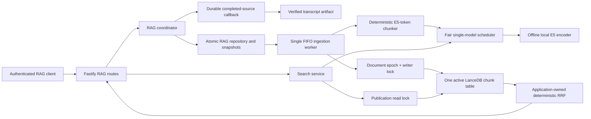
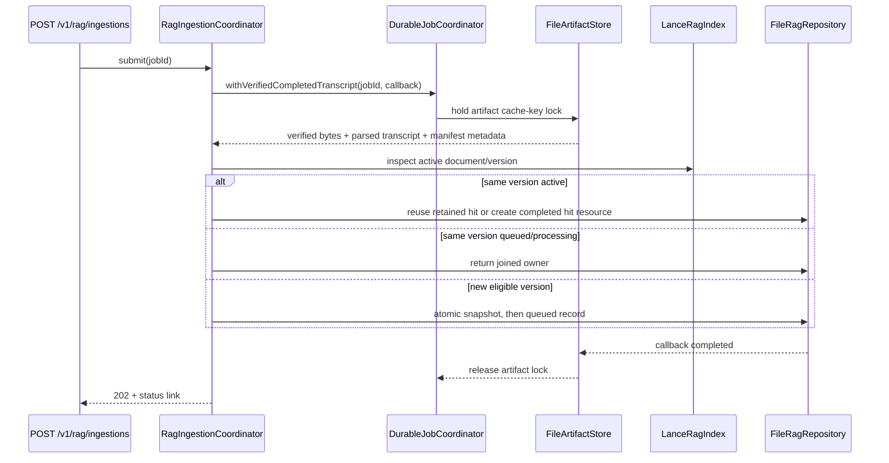
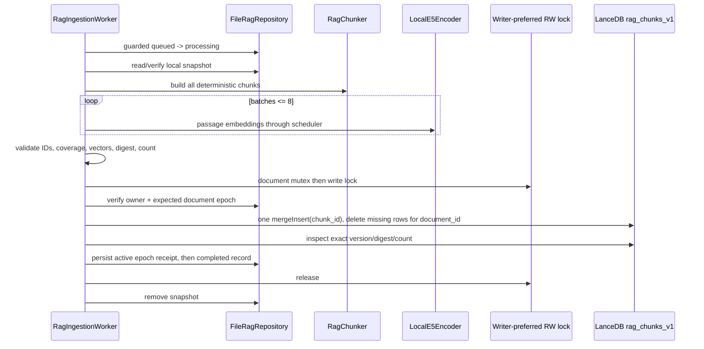

# RAG-native LanceDB Ingestion Design

**Spec**: `.specs/features/rag-lancedb/spec.md`
**Status**: Approved on 2026-08-26 (including the VER-03 clarification)

---

## Architecture Decision

The user approved **Approach A** on 2026-08-26: one active LanceDB chunk table is the sole authority
for searchable content. A single `mergeInsert` replaces every chunk of one logical document, while
application-owned atomic JSON files hold only ingestion state, source snapshots, tombstones, schema
intent, and crash-recovery epochs. Searches never consult a JSON pointer to decide visibility.

### Considered approaches

| Approach | Decision | Trade-off |
| -------- | -------- | --------- |
| One active chunk table, atomic per-document `mergeInsert` | **Selected** | Repeats provenance per chunk, but gives one Lance transaction and global search without cross-store publication. |
| Separate document catalog and chunk tables | Rejected | Normalizes metadata but adds a cross-table commit boundary that LanceDB JS does not expose atomically. |
| One table per document/version | Rejected | Isolates writes but complicates global hybrid search, FTS maintenance, and table lifecycle. |

The exact LanceDB 0.37.1 API was smoke-tested in a temporary Node 22 installation. Its
`mergeInsert` can update, insert, and conditionally delete target rows in one commit. The actual JS
predicate accepted by `whenNotMatchedBySourceDelete` is the unqualified
`document_id = '<validated-sha256>'`; a `target.` prefix is not used. Multiple matches are undefined,
so the adapter validates unique chunk IDs before every merge and verifies the committed
document/version/count afterward.

---

## Architecture Overview



The system has three independent capacity domains:

1. The existing transcript execution controller continues to protect YouTube/media/Muse work.
2. One RAG worker and one encoder instance serialize ingestion batches.
3. A separate controller admits at most four searches; a fair encoder scheduler serializes their
   query embedding with ingestion batches.

No RAG path acquires a transcript execution permit and no RAG path calls the transcript service,
PDF renderer, media pipeline, Muse, or a remote model.

---

## End-to-end Flows

### Submission and source snapshot



`DurableJobCoordinator.withVerifiedCompletedTranscript` checks the job state and its `expiresAt`
against the current clock before artifact access. The `FileArtifactStore` callback holds the
existing cache-key lock while it validates the transcript manifest, byte length, SHA-256, strict
JSON shape, and writes the RAG snapshot. PDF bytes are not read: PDF corruption is unrelated to the
trusted transcript source.

For a miss, the RAG repository publishes in this order:

1. `snapshots/<ingestionId>.<uuid>.tmp/transcript.json` and `manifest.json` with synced files.
2. Atomic same-parent rename to the final snapshot directory.
3. Atomic `queued` ingestion record referencing the snapshot.
4. Worker notification and HTTP 202.

If step 3 fails, the unpublished snapshot is removed. Startup removes only schema-recognized stale
temporary paths; request text and identifiers are never logged during cleanup.

### Ingestion and atomic replacement



All chunks/vectors live in memory until validation succeeds. The maximum is 5,000 chunks; 5,000
384-dimensional float32 vectors consume about 7.7 MB before object overhead, which is bounded and
smaller than staging partial searchable rows. The merge is:

```ts
await table
  .mergeInsert('chunk_id')
  .whenMatchedUpdateAll()
  .whenNotMatchedInsertAll()
  .whenNotMatchedBySourceDelete({ where: documentPredicate(documentId) })
  .useIndex(false)
  .execute(rows, { timeoutMs: 120_000 })
```

`documentPredicate` accepts only an already validated lowercase SHA-256 value and is the only code
allowed to construct the SQL literal. New chunk IDs include `versionId`, so the delete clause
removes every surplus row from the prior version while preserving all other documents. Search,
DELETE, publication, and maintenance share a writer-preferred read/write lock. Therefore vector
and FTS halves of a search observe the same table generation, while every mutation is old-or-new.

### Hybrid search

1. Fastify Bearer authentication and strict schema validation run first.
2. The search controller admits at most `MAX_CONCURRENT_RAG_SEARCHES` requests.
3. The scheduler embeds `query: ${trimmedQuery}` with the one model instance.
4. Search acquires the publication read lock.
5. LanceDB returns up to 50 cosine candidates and up to 50 Portuguese FTS candidates with the same
   optional validated document filter. Neither query uses `fastSearch()`.
6. Each list is re-sorted by raw distance/score and stable chunk identity before ranks are assigned.
7. The application fuses at most 100 unique candidates using `1 / (60 + rank)` per present list.
8. Final order is fused score descending, then `documentId`, `versionId`, and ordinal ascending.
9. Only selected columns and public provenance are mapped; vectors and the input query are dropped.
10. The lock and search permit are released in `finally` blocks.

Application-owned RRF is preferred over the native reranker because it makes the 100-candidate cap,
score semantics, tie-break, and three-run determinism directly testable.

---

## Code Reuse Analysis

### Existing Components to Leverage

| Component | Location | How to use |
| --------- | -------- | ---------- |
| `AtomicFileWriter` | `src/infrastructure/storage/atomic-file-writer.ts` | Reuse same-root sync/write/rename and path-confinement behavior for RAG JSON/snapshots. |
| Cache-key artifact lock | `src/infrastructure/storage/file-artifact-store.ts` | Extend with a callback that keeps the verified transcript locked until the RAG snapshot is durable. |
| Durable state transition pattern | `src/domain/job.ts` | Mirror revision-guarded immutable transitions and allowlisted public failure construction. |
| `FileJobRepository` | `src/infrastructure/storage/file-job-repository.ts` | Mirror exact-key parsers, in-memory indexes, mutex, temp cleanup, quarantine, sweeps, and tombstones under a separate root. |
| `DurableJobWorker` | `src/application/durable-job-worker.ts` | Mirror one FIFO loop, notification, guarded claim, batch-boundary abort, and idempotent recovery. |
| Bearer hook and fixed errors | `src/http/app.ts` | Pass the same `onRequest` hook into RAG routes; extend the centralized error handler with `RagError`. |
| Job route module | `src/http/job-routes.ts` | Follow isolated route registration and strict Fastify schemas without exposing coordinator internals. |
| `RuntimeMetrics` registry | `src/infrastructure/observability/runtime-metrics.ts` | Register RAG metric families in the same protected endpoint using closed label allowlists. |
| App lifecycle/composition | `src/app.ts`, `src/http/app.ts` | Compose one RAG subsystem and include it in readiness/start/stop without changing transcript execution. |
| OpenAPI parser/parity tests | `src/http/openapi.ts`, `test/integration/openapi.test.ts` | Extend the existing additive document/snapshot/parity gate to 13 operations including DELETE. |

### Concerns in reused code

- `readForJob` currently releases its cache-key lock before another subsystem can persist a copy;
  the callback boundary is required, not a read-then-write sequence.
- `parseTranscript` is private inside the artifact store. The new callback returns already-validated
  raw bytes plus parsed data; RAG does not duplicate or weaken the transcript parser.
- OpenAPI currently has a route schema plus a job-specific transform layer. RAG schemas are exported
  once from `rag-routes.ts` and referenced by the OpenAPI transform to avoid a third duplicate set.
- `RuntimeMetrics` is already broad. Private RAG metric construction/helpers keep the public class
  compatible while route/worker interfaces receive only the methods they need.

---

## Components and Interfaces

### RAG domain

- **Location**: `src/domain/rag.ts`
- **Purpose**: IDs, records, transitions, public resources, failure allowlists, and strict value
  validation independent of Fastify/LanceDB.
- **Interfaces**:

```ts
type RagIngestionStatus = 'queued' | 'processing' | 'completed' | 'failed'
type RagIngestionDisposition = 'miss' | 'joined' | 'hit'

function assertRagIngestionId(value: string): string
function assertDocumentId(value: string): string
function computeDocumentId(cacheKey: string): string
function computeVersionId(identity: RagVersionIdentity): string
function computeChunkId(identity: RagChunkIdentity): string
function transitionRagIngestion(
  record: RagIngestionRecord,
  expectedRevision: number,
  transition: RagIngestionTransition,
): RagIngestionRecord
function toPublicRagIngestion(record: RagIngestionRecord): PublicRagIngestion
```

Every hash uses canonical JSON with fixed key order, UTF-8, lowercase SHA-256, and explicit policy
versions. UUIDs use the existing non-enumerable UUID pattern.

### Verified durable source boundary

- **Locations**: `src/application/durable-job-coordinator.ts`,
  `src/infrastructure/storage/file-artifact-store.ts`
- **Purpose**: translate source job states and keep the artifact lock through snapshot publication.
- **Interface**:

```ts
interface VerifiedCompletedTranscript {
  sourceJobId: string
  artifactId: string
  cacheKey: string
  artifactExpiresAt: string
  transcriptSha256: string
  transcriptBytes: Buffer
  transcript: Transcript
}

interface RagTranscriptSource {
  withVerifiedCompletedTranscript<T>(
    jobId: string,
    consume: (source: VerifiedCompletedTranscript) => Promise<T>,
  ): Promise<T>
}
```

The boundary checks `expiresAt <= now` before artifact I/O even if the durable sweeper has not yet
published its tombstone. All source-state failures keep their existing public codes.

### RAG coordinator

- **Location**: `src/application/rag-ingestion-coordinator.ts`
- **Purpose**: lifecycle, submit/join/hit/capacity decisions, status, delete, readiness, sweeps, and
  composition of repository/worker/index/encoder.
- **Interface**:

```ts
interface RagApplicationCoordinator {
  readonly isReady: boolean
  start(): Promise<void>
  stop(): Promise<void>
  submit(jobId: string): Promise<RagIngestionSubmission>
  get(ingestionId: string): Promise<PublicRagIngestion>
  search(request: RagSearchRequest, signal?: AbortSignal): Promise<RagSearchResponse>
  delete(documentId: string): Promise<void>
}
```

Submission serialization plus the per-document mutex makes miss/join/hit and queue/free-space checks
linearizable. `start()` absorbs known RAG initialization failures, records degraded state, and
schedules local retry; it does not prevent Fastify from serving `/health` or existing routes.

### RAG repository and snapshot store

- **Locations**: `src/infrastructure/rag/file-rag-repository.ts`,
  `src/infrastructure/rag/rag-storage-paths.ts`
- **Purpose**: crash-consistent ingestion records, source snapshots, tombstones, document epochs,
  probes, and recovery scans.
- **Key interfaces**:

```ts
interface RagRepository {
  initialize(): Promise<RagRecoverySnapshot>
  createQueued(input: CreateQueuedRagIngestion): Promise<RagIngestionRecord>
  createCompletedHit(input: CreateCompletedHit): Promise<RagIngestionRecord>
  get(id: string): Promise<RagIngestionRecord | RagIngestionTombstone | undefined>
  activeOwner(documentId: string): RagIngestionRecord | undefined
  oldestQueued(): RagIngestionRecord | undefined
  transition(id: string, revision: number, value: RagIngestionTransition): Promise<RagIngestionRecord>
  readSnapshot(reference: RagSnapshotReference): Promise<VerifiedCompletedTranscript>
  inspectEpoch(documentId: string): Promise<RagDocumentEpoch>
  writeEpoch(expectedGeneration: number, next: RagDocumentEpoch): Promise<void>
  sweep(now: Date): Promise<RagSweepResult>
  probe(minFreeBytes: number): Promise<RagStorageProbe>
}
```

Completed hits reuse a retained completed ingestion record. When its record and tombstone have been
removed, the coordinator creates a fresh completed `hit` resource with a new UUID and fixed 24-hour
metadata retention, while document/version identity and index rows remain untouched. This resolves
the otherwise contradictory indefinite document lifetime and 48-hour ingestion-resource lifetime.

### Deterministic chunker

- **Location**: `src/application/rag-chunker.ts`
- **Purpose**: exact coverage, segment/timestamp provenance, E5 token bounds, and stable chunk IDs.
- **Interface**:

```ts
interface RagTokenizer {
  countModelTokens(text: string): number
}

interface RagChunker {
  chunk(source: VerifiedCompletedTranscript, versionId: string): RagChunk[]
}
```

The chunker first verifies `Transcript.text === segments.map(text).join(' ')`, which is the invariant
used by both current transcript producers. It builds segment spans in Unicode code-point offsets.
All public offsets are half-open code-point ranges; UTF-16 code-unit positions are never persisted.
It also keeps a code-point-to-code-unit boundary map for exact JS slicing without splitting surrogate
pairs. Combining-mark/grapheme boundaries are preferred through deterministic Unicode property
checks, but exact source coverage takes precedence.

Core spans are ordered and non-overlapping. For each chunk the algorithm chooses the largest prior
suffix whose actual E5 token count is at most 48, then greedily grows the core up to 320 total actual
model tokens including `passage: ` and special tokens. Segment ends are tried first; if an oversized
segment does not fit, binary search finds the largest Unicode-safe prefix. Whitespace-only spans are
attached to adjacent usable content; an all-whitespace document fails `RAG_SOURCE_UNAVAILABLE`.

### Offline encoder and fair scheduler

- **Locations**: `src/infrastructure/rag/local-e5-encoder.ts`,
  `src/application/rag-encoder-scheduler.ts`, `src/infrastructure/rag/model-manifest.ts`
- **Purpose**: one verified local pipeline, actual tokenizer access, vector validation, and fair
  serialization between searches and ingestion batches.
- **Interfaces**:

```ts
interface RagEncoder {
  initialize(): Promise<void>
  countModelTokens(text: string): number
  embedQuery(query: string, signal?: AbortSignal): Promise<Float32Array>
  embedPassages(passages: readonly string[], signal?: AbortSignal): Promise<Float32Array[]>
  close(): Promise<void>
}

interface RagEncoderScheduler {
  runSearch<T>(signal: AbortSignal | undefined, task: () => Promise<T>): Promise<T>
  runIngestionBatch<T>(signal: AbortSignal, task: () => Promise<T>): Promise<T>
  stop(): void
}
```

The scheduler allows at most four consecutive waiting search embeddings when ingestion is waiting,
then admits one ingestion batch. Ingestion releases the encoder after every batch of at most eight.
The ONNX call itself is not force-cancelled; signals are checked before and after each call, which
implements the required batch-boundary abort without disposing a shared live session.

### LanceDB index adapter

- **Location**: `src/infrastructure/rag/lancedb-rag-index.ts`
- **Purpose**: encapsulate every LanceDB/Arrow API, schema/fingerprint validation, atomic replacement,
  immediate delete, candidates, recovery inspection, probes, and safe optimization.
- **Interface**:

```ts
interface RagIndex {
  initialize(): Promise<void>
  inspectDocument(documentId: string): Promise<IndexedDocumentState | undefined>
  replaceDocument(rows: readonly RagChunkRow[]): Promise<RagPublicationReceipt>
  deleteDocument(documentId: string): Promise<RagDeleteReceipt>
  vectorCandidates(vector: Float32Array, filter: RagSearchFilter, limit: number): Promise<RagVectorCandidate[]>
  textCandidates(query: string, filter: RagSearchFilter, limit: number): Promise<RagTextCandidate[]>
  probe(): Promise<boolean>
  optimize(): Promise<void>
  close(): Promise<void>
}
```

It connects locally with `readConsistencyInterval: 0`, creates `rag_chunks_v1` only when absent,
uses an explicit Arrow 18.1 schema, and creates one FTS index on `text`:

```ts
Index.fts({
  withPosition: false,
  baseTokenizer: 'icu',
  language: 'Portuguese',
  maxTokenLength: 80,
  lowercase: true,
  stem: true,
  removeStopWords: true,
  asciiFolding: true,
  blockSize: 128,
})
```

No ANN/scalar index is created initially. Flat vector search is exact and appropriate for the
bounded initial corpus. FTS normal queries scan the unindexed tail, so fresh rows remain visible;
the adapter never exports a builder or calls `fastSearch()`.

### Search service and capacity controller

- **Locations**: `src/application/rag-search-service.ts`,
  `src/application/rag-search-controller.ts`, `src/application/async-read-write-lock.ts`
- **Purpose**: strict bounded admission, encoder scheduling, same-generation vector/FTS reads,
  deterministic RRF, response mapping, writer preference, and shutdown cancellation.
- **Reuses**: idempotent permit/release ideas from `ExecutionController` without adding RAG labels to
  transcript metric families.

### RAG worker

- **Location**: `src/application/rag-ingestion-worker.ts`
- **Purpose**: FIFO claim, snapshot read, chunk/embed/validate, epoch-fenced publication, terminal
  transition, cleanup, restart recovery, and shutdown at batch boundaries.
- **Dependencies**: repository, chunker, encoder scheduler, index, document mutex, RW lock, metrics.

### HTTP routes and OpenAPI

- **Locations**: `src/http/rag-routes.ts`, `src/http/app.ts`, `src/http/openapi.ts`
- **Purpose**: four protected operations, exact headers/bodies, shared error handler, OpenAPI 1.2.0,
  and 13-operation parity including DELETE.
- **Design rule**: RAG route schemas are exported once and reused by the OpenAPI transform. The route
  collector is extended from GET/POST to GET/POST/DELETE.

---

## Persistent Layout

```text
<RAG_DATA_ROOT>/
└── v1/
    ├── database/                         # LanceDB database URI
    │   └── rag_chunks_v1.lance/
    ├── index-manifest.json              # creating/ready + exact fingerprints/FTS policy
    ├── ingestions/<2>/<uuid>.json
    ├── tombstones/<2>/<uuid>.json
    ├── documents/<2>/<sha256>.json       # epoch/delete intent/recovery receipt only
    ├── snapshots/<2>/<uuid>/
    │   ├── transcript.json
    │   └── manifest.json
    ├── quarantine/<opaque-uuid>.invalid
    └── probe/<opaque-uuid>.probe
```

Every application path is derived only from validated UUID/SHA-256 values. LanceDB owns only its
fixed database directory. `AtomicFileWriter` rejects symlinks/path escape for application state;
startup rejects a symlinked RAG root/database boundary before connecting.

The index manifest has `creating` and `ready` states. A crash during first creation may finish only
when the table has the exact expected empty schema and no rows; any non-empty/mismatched incomplete
index fails closed and is preserved for operator inspection.

---

## Data Models

### Ingestion record

```ts
interface RagIngestionRecord {
  schemaVersion: 1
  revision: number
  ingestionId: string
  documentId: string
  versionId: string
  targetGeneration: number
  status: 'queued' | 'processing' | 'completed' | 'failed'
  source: {
    jobId: string
    artifactId: string
    cacheKey: string
    artifactExpiresAt: string
    transcriptSha256: string
  }
  snapshot: RagSnapshotReference | null
  expectedChunkCount: number | null
  documentDigest: string | null
  publication: { lanceVersion: number; changedRows: number } | null
  createdAt: string
  updatedAt: string
  startedAt: string | null
  completedAt: string | null
  expiresAt: string | null
  failure: PublicRagFailure | null
}
```

Legal transitions are `queued -> processing -> completed|failed`. Recovery may move a verified
pre-commit `processing` record back to `queued` with a revision increment; a verified post-commit
record goes directly to `completed`. No terminal state transitions back to runnable work.

### Document epoch

```ts
interface RagDocumentEpoch {
  schemaVersion: 1
  documentId: string
  generation: number
  state: 'active' | 'delete_pending' | 'deleted'
  activeVersionId: string | null
  publishedIngestionId: string | null
  expectedChunkCount: number
  documentDigest: string | null
  updatedAt: string
}
```

This file fences stale workers and makes a crashed delete recoverable. It is not a search pointer.
Searchability is determined solely by rows in `rag_chunks_v1`. Lock order is always:

```text
submission mutex -> document mutex -> publication write lock -> LanceDB -> epoch/record receipt
```

A component may start later in this order but never acquire in reverse.

### LanceDB chunk row

```ts
interface RagChunkRow {
  chunk_id: string
  document_id: string
  version_id: string
  published_ingestion_id: string
  generation: number
  ordinal: number
  chunk_count: number
  chunk_checksum: string
  document_digest: string
  text: string
  core_start: number
  core_end: number
  overlap_start: number
  overlap_end: number
  segment_start: number
  segment_end: number
  start_seconds: number | null
  end_seconds: number | null
  video_id: string
  source_url: string
  transcript_source: 'youtube_captions' | 'muse_transcription'
  language: string
  is_generated: boolean
  timestamp_precision: 'caption' | 'chunk'
  extracted_at: string
  source_job_id: string
  artifact_id: string
  cache_key: string
  artifact_expires_at: string
  transcript_sha256: string
  index_schema_version: 1
  chunk_policy_version: 1
  embedding_fingerprint: string
  vector: Float32Array // Arrow fixed_size_list<float32>[384]
}
```

Ranges are half-open. `segment_end` is exclusive. `text` contains overlap plus core; core ranges
partition the exact transcript. Timestamps are the minimum original start and maximum known original
end of covered segments; a missing duration yields nullable end and no interpolation.

### Public search result

```ts
interface PublicRagSearchResult {
  rank: number
  score: number
  chunkId: string
  documentId: string
  versionId: string
  text: string
  ranges: {
    core: { start: number; end: number }
    segments: { start: number; end: number }
    timestamps: { startSeconds: number | null; endSeconds: number | null }
  }
  source: {
    videoId: string
    sourceUrl: string
    transcriptSource: string
    language: string
    isGenerated: boolean
    timestampPrecision: string
    extractedAt: string
    sourceJobId: string
    artifactId: string
    cacheKey: string
    artifactExpiresAt: string
    transcriptSha256: string
    chunkPolicyVersion: number
    embeddingFingerprint: string
  }
}
```

The authenticated retrieval contract intentionally includes provenance IDs; AD-009 still forbids
them in logs/metrics. Query text is not returned.

---

## Crash and Race Recovery

| Durable boundary at crash | Startup action before RAG readiness |
| ------------------------- | ----------------------------------- |
| Snapshot directory exists, no record | Remove only if its manifest/UUID proves it is an orphan. |
| Queued record + valid snapshot | Restore FIFO owner and run locally. |
| Processing, table still prior/absent | Revision-guarded requeue; reuse snapshot; no provider call. |
| `mergeInsert` committed, epoch/record stale | Inspect exact version/digest/count, persist active epoch/receipt, complete without re-embedding. |
| Epoch active, record still processing | Verify table then complete record and remove snapshot. |
| `delete_pending`, rows still present | Complete idempotent Lance delete, mark deleted, then recover workers. |
| Epoch deleted, stale processing ingestion | Fail it before worker start; it cannot republish that generation. |
| Mixed versions, duplicate chunk IDs, wrong digest/count | Preserve files, mark RAG degraded, fail readiness closed; no automatic rewrite. |
| Unknown merge timeout/error | Inspect document under write lock; accept only exact target state, otherwise preserve prior or degrade on impossible mixed state. |

DELETE writes `delete_pending` with `generation + 1` under the write lock before deleting rows. A new
explicit ingestion after deletion targets the next generation and is allowed; an older worker's
expected generation no longer matches. Search cannot run between delete intent and Lance deletion.

---

## Model and Dependency Supply Chain

### Pinned dependencies

| Package/artifact | Pin | Reason |
| ---------------- | --- | ------ |
| `@lancedb/lancedb` | `0.37.1` | Current stable local JS API smoke-tested with Node 22/Linux x64. |
| `apache-arrow` | `18.1.0` | Explicit supported peer; owns the fixed vector schema. |
| `@huggingface/transformers` | `4.2.0` | Current API used for offline Node feature extraction and model disposal. |
| Model | `Xenova/multilingual-e5-small` revision `761b726dd34fb83930e26aab4e9ac3899aa1fa78` | Immutable Transformers.js ONNX conversion of the MIT-licensed upstream multilingual E5 small model. |

LanceDB declares optional Transformers 3.0.2. `package.json` adds an override forcing that optional
edge to the directly pinned 4.2.0, preventing two Transformers/ONNX trees. The application never
imports the LanceDB embedding registry. A temporary `npm install --ignore-scripts` plus Node 22
LanceDB query and real offline E5 int8 smoke both passed with this exact override.

### Model manifest

The checked-in manifest lists exactly these runtime files:

| File | Bytes | SHA-256 |
| ---- | ----: | ------- |
| `config.json` | 658 | `cb99455288675345e1a4f411438d5d0adbba5fbd3a67ea4fb03c015433b996c1` |
| `special_tokens_map.json` | 167 | `d05497f1da52c5e09554c0cd874037a083e1dc1b9cfd48034d1c717f1afc07a7` |
| `tokenizer.json` | 17,082,730 | `0b44a9d7b51c3c62626640cda0e2c2f70fdacdc25bbbd68038369d14ebdf4c39` |
| `tokenizer_config.json` | 443 | `a1d6bc8734a6f635dc158508bef000f8e2e5a759c7d92f984b2c86e5ff53425b` |
| `onnx/model_int8.onnx` | 118,054,593 | `4d24e2bc01a447951524466ef533e52944bf48509e6552810bcee1a2711cb02c` |

The Docker build downloads only immutable revision URLs, verifies size/hash, and copies the model to
`/app/models/Xenova/multilingual-e5-small`. Runtime sets `RAG_MODEL_ROOT=/app/models`,
`env.allowRemoteModels=false`, `env.allowLocalModels=true`, and `local_files_only=true`. It verifies
all hashes before pipeline creation, warms one query, then validates 384 finite floats and norm
`1 +/- 1e-4`. The local smoke produced 384 values with norm `1.0000000408255632`.

`onnxruntime-node` contains other-platform binaries even with ignored scripts. The runtime image
removes only its Darwin/Windows/Linux-arm64 directories after `npm ci`, retaining Linux x64 CPU
files, and immediately runs a build-stage offline encoder smoke. It does not delete CUDA providers
by glob or alter a host installation. A container test inspects the retained files and executes the
real model before the image is accepted.

---

## Configuration

| Environment variable | Default | Strict bounds |
| -------------------- | ------- | ------------- |
| `RAG_DATA_ROOT` | `.data/lancedb` | non-empty path |
| `RAG_MODEL_ROOT` | `.models` | non-empty path; Docker `/app/models` |
| `MAX_QUEUED_RAG_INGESTIONS` | `25` | 1-1000 |
| `MAX_CONCURRENT_RAG_SEARCHES` | `4` | 1-32 |
| `RAG_SEARCH_RETRY_AFTER_SECONDS` | `5` | 1-3600 |
| `FAILED_RAG_INGESTION_TTL_SECONDS` | `86400` | 60-604800 |
| `RAG_INGESTION_TOMBSTONE_TTL_SECONDS` | `86400` | 60-604800 |
| `RAG_SWEEP_INTERVAL_MS` | `60000` | 1000-3600000 |
| `RAG_MAX_SOURCE_CODE_POINTS` | `5000000` | 10000-20000000 |
| `RAG_MAX_CHUNKS_PER_DOCUMENT` | `5000` | 1-20000 |
| `RAG_EMBEDDING_BATCH_SIZE` | `8` | 1-8 |
| `RAG_MIN_FREE_BYTES` | `134217728` | 16777216-536870912 |

Messages for invalid values include the environment variable and numeric/path rule only. Model ID,
revision, dimension, chunk/search policies, merge timeout, and fingerprints are code/manifest
constants so operators cannot accidentally create mixed vectors through environment drift.

Railway IaC adds only `RAG_DATA_ROOT=/data/lancedb`; Docker owns `RAG_MODEL_ROOT`. One service,
replica, and 1024 MB `/data` Volume remain unchanged.

---

## HTTP and Error Handling

| Scenario | HTTP / code | Handling |
| -------- | ----------- | -------- |
| Invalid body/UUID/SHA/query/filter | 400 `INVALID_REQUEST` | Fastify schema/domain validation before source/model/storage. |
| Source job absent/active/failed/expired/storage | Existing job error | Durable source boundary preserves `JOB_*` contract. |
| Ingestion absent/expired | 404 `RAG_INGESTION_NOT_FOUND` / 410 `RAG_INGESTION_EXPIRED` | Repository/tombstone lookup. |
| Document absent/deleted | 404 `RAG_DOCUMENT_NOT_FOUND` | Index inspection under document/read boundary. |
| Different version already updating | 409 `RAG_DOCUMENT_UPDATE_IN_PROGRESS`, retry 2 | No snapshot or new work. |
| Ingestion queue full | 429 `RAG_INGESTION_QUEUE_CAPACITY_EXCEEDED`, retry 30 | Hit/join evaluated first. |
| Four searches admitted | 429 `RAG_SEARCH_CAPACITY_EXCEEDED`, retry configured default 5 | Reject before encoder/index. |
| Free reserve breached before miss | 507 `RAG_STORAGE_CAPACITY_EXCEEDED` | No snapshot/record; hit/join/search/status/delete remain. |
| Model missing/hash/vector failure | 503 `RAG_MODEL_UNAVAILABLE` | RAG degraded, no remote fallback. |
| Lance/state I/O/schema corruption | 503 `RAG_STORAGE_UNAVAILABLE` | Preserve data, RAG degraded, no silent overwrite/migration. |
| Worker source too large | persisted `RAG_SOURCE_TOO_LARGE` | Fixed public failure, no active rows. |
| Worker source unusable | persisted `RAG_SOURCE_UNAVAILABLE` | Fixed public failure, no provider retry. |
| Encoder execution failure | persisted `RAG_EMBEDDING_FAILED` | Fixed public failure, prior version unchanged. |
| Unexpected error | 500 existing envelope | Fixed log code only; no nested cause. |

All four RAG routes use the existing Bearer hook before Fastify body/params validation. Public and
persisted messages come from closed maps. No error/log includes the job/document/video identity,
query, transcript, chunk, vector, URL, path, model input, credentials, exception message, stack, or
nested cause.

---

## Readiness, Metrics, and Maintenance

`RagIngestionCoordinator.start()` performs repository/index/model initialization, warmup, delete
reconciliation, processing recovery, worker start, and sweep scheduling. A RAG-only failure sets
`isReady=false` but does not throw through Fastify `onReady`; this keeps `/health` and existing
transcript/job handlers callable as OPS-04 requires. RAG routes then return fixed 503 until a bounded
local retry succeeds. `/ready` requires the existing execution controller, durable coordinator, and
RAG coordinator all ready.

Shutdown order is:

1. Transcript and RAG readiness false; reject new expensive work.
2. Abort search waiters and stop RAG claims.
3. Finish/abort at the current encoder batch boundary and persist recoverable state.
4. Stop durable transcript worker through its existing lifecycle.
5. Close LanceDB/model handles.

RAG metrics share the protected Prometheus registry and use only these fixed labels:

- submission `disposition`: `miss|joined|hit|rejected`
- ingestion `status`: `queued|processing`; terminal `outcome`: `completed|failed|interrupted`
- failure `reason`: `source_too_large|source_unavailable|embedding|storage|capacity|unknown`
- component health: `repository|index|model|worker`
- search `outcome`: `success|failure|capacity|aborted`; bounded result-count buckets, no values
- maintenance `operation`: `reconcile|sweep|optimize|delete`; fixed outcome

Gauges expose active documents/chunks, queued/processing ingestions, search concurrency, and component
health without per-document labels.

After 20 successful mutations or 100,000 changed rows, the worker schedules `optimize()` under the
publication write lock. It never uses `deleteUnverified`; aggressive cleanup with
`cleanupOlderThan` is disabled until an operator backup policy exists. Search remains complete before
optimization because normal FTS scans recent unindexed fragments.

---

## Verification and Retrieval Evaluation

### Test layers

- Unit: hashes/transitions/errors, exact config bounds, path confinement, snapshot failure order,
  Unicode/token chunking, scheduler fairness/abort, RRF/ties, metrics allowlists, SQL predicate helper.
- Integration with temporary files: submission/source-expiry races, queue/hit/join, terminal sweep,
  crash matrix, delete epochs, no source calls, readiness degradation and local retry.
- Real LanceDB: explicit schema/FTS, immediate vector/FTS/hybrid visibility after replace without
  optimize, smaller replacement deletion, unrelated document preservation, restart, delete, corrupt
  fingerprints, same-generation read lock, and Node 22 native smoke.
- Real model: checked hashes, runtime network disabled, actual token 319/320/321 boundaries, golden
  vector cosine >= 0.995, dimension/norm/finite checks, batch abort, and disposal.
- HTTP/OpenAPI: four protected operations, auth-first dependency spies, exact headers/statuses/body,
  13-operation parser/snapshot/parity/security/secret absence including DELETE.
- Container: Linux x64 production dependencies, local model present, network-denied embedding,
  LanceDB replace/search/delete, non-root writable `/data`, size/RSS report, and health/readiness.

### Automotive retrieval fixture

The fixture is authored, fictional test content and never presented as vehicle advice. It contains
12 documents and 48 Portuguese questions with qrels based on document plus segment/code-point ranges:

- 12 exact model/version/acronym questions
- 12 semantic paraphrases
- 8 model/year/fuel disambiguations
- 8 accent/typo questions
- 4 numbers/units
- 4 negative/distractor questions

One command runs vector-only, FTS-only, and hybrid on the same real local model/table. Hybrid gates:

- Recall@5 >= 0.90
- MRR@10 >= 0.80
- nDCG@10 >= 0.85
- exact/numeric Recall@3 >= 0.95
- semantic Recall@5 >= 0.85
- accent/typo Recall@5 >= 0.80
- zero wrong-model/year top-1 in the eight disambiguation cases
- three executions return identical IDs/ranks

Latency p50/p95, peak RSS, image size, and index bytes are recorded but remain non-blocking until a
real Railway baseline exists. The evaluation performs no network request and needs no credential.

---

## Risks & Concerns

| Concern | Location / evidence | Impact | Mitigation |
| ------- | ------------------- | ------ | ---------- |
| Indefinite document vs expired ingestion status (spec precision) | `spec.md` VER-03/LIFE-06 | A late hit could return a dead status URL. | Clarified VER-03: preserve document/version, create fresh completed hit metadata only after prior metadata/tombstone are gone; require explicit approval with Design. |
| Vector and FTS halves can cross a publication | New hybrid flow | Mixed old/new result set despite per-query MVCC. | Writer-preferred read lock wraps both queries and RRF; all mutations/optimize take write lock. |
| Delete can race an already embedding worker | New async worker | Deleted content could reappear. | Persistent document generation/delete intent, fixed lock order, revalidation immediately before merge, delete recovery before worker recovery. |
| Source bundle can expire between read and snapshot | `file-artifact-store.ts` cache-key lock | Accepted queued ingestion could lack source. | Callback retains artifact lock through verified RAG snapshot and queued record publication. |
| RAG startup failure through Fastify `onReady` | `src/http/app.ts` lifecycle | `/health` and existing routes would never listen. | RAG start absorbs known failure, marks degraded, exposes fixed RAG 503, and retries locally; durable core behavior unchanged. |
| Lance native + ORT + model image size/RAM | New dependencies; temporary install ~596 MB before pruning | Slow deploy/start or Railway memory pressure. | One Transformers override, CPU/Linux-x64-only runtime pruning, packaged int8 model, one session, batch 8, container smoke and RSS/image report before deploy. |
| Optional LanceDB Transformers 3.0.2 duplicates 4.2.0 | npm metadata/temporary install | Two ONNX runtimes and ambiguous behavior. | Root override to 4.2.0; never use Lance embedding registry; lockfile/tree assertion and real smoke. |
| FTS can omit recent rows with `fastSearch` | LanceDB FTS API | Search violates immediate publication. | Encapsulated adapter never exposes/calls it; integration test immediately after merge before optimize. |
| `mergeInsert` duplicate matches are undefined | LanceDB 0.37.1 API | Duplicate rows/corrupt replacement. | Deterministic unique IDs, pre-merge uniqueness assertion, post-merge exact digest/count/version inspection, fail readiness on impossible state. |
| SQL predicates are strings | LanceDB filter API | Injection if raw input reaches predicates. | UUID/SHA-only validators and a single quoted-literal helper with direct mutation tests; raw query never becomes SQL. |
| JS UTF-16 offsets split Unicode | `Transcript.text` is a JS string | Invalid coverage/provenance. | Persist code-point half-open offsets, maintain conversion map, prefer grapheme-safe boundaries, emoji/combining fixtures. |
| Transcript parser does not assert text/segment join invariant | `file-artifact-store.ts` parser | Segment provenance could be impossible. | Chunker validates exact join and fails sanitized without changing the existing public transcript parser. |
| OpenAPI currently ignores DELETE and duplicates job transforms | `src/http/openapi.ts` | Route parity drift. | Extend method collector and reference one exported RAG schema set from both routes/transform. |
| Shared 1 GB Volume and Lance versions/fragments | Railway topology | RAG can starve transcript artifacts. | 128 MiB admission reserve, active/chunk/index metrics, bounded documents/chunks, conservative optimize, capacity runbook and later size decision from metrics. |
| Logical delete is not secure physical erase | Lance fragments/Railway backups | Privacy expectation mismatch. | Immediate search removal, explicit docs, no secure-erase claim, no aggressive cleanup before backup policy. |

---

## Tech Decisions

| Decision | Choice | Rationale |
| -------- | ------ | --------- |
| Searchable authority | One active `rag_chunks_v1` LanceDB table | A single merge commit supplies atomic per-document replacement and global search. |
| File state role | Ingestion/snapshot/tombstone/epoch/recovery only | Files fence crashes/deletes but never create split-brain search visibility. |
| Publication | `mergeInsert('chunk_id')` plus document-scoped delete | One transaction inserts target and removes all surplus old chunks. |
| Concurrency | Document mutex + writer-preferred publication RW lock | Prevents resurrection and keeps vector/FTS on one generation. |
| Hybrid fusion | Two bounded queries + application RRF k=60 | Enforces candidate cap, finite score, deterministic ties, and evaluation visibility. |
| Embeddings | Pinned offline multilingual E5 int8 through application adapter | Portuguese retrieval without paid calls or runtime downloads. |
| Model/runtime versions | Transformers 4.2.0 override, LanceDB 0.37.1, Arrow 18.1.0 | One dependency tree, explicit schema, and smoke-tested Node 22 compatibility. |
| Chunk offsets | Unicode code points, half-open | Stable public provenance across JS/non-JS consumers without splitting surrogate pairs. |
| RAG retention | No automatic document TTL | Knowledge-base membership changes only by explicit delete/replacement. |
| ANN | Deferred | Exact flat search is simpler and suitable for the bounded initial corpus. |
| RAG-only startup failure | Degraded RAG, server stays live | Satisfies callable `/health`/transcript routes while `/ready` truthfully fails. |

### Primary documentation used

- LanceDB hybrid search and explicit-vector TypeScript API:
  https://docs.lancedb.com/search/hybrid-search
- LanceDB FTS completeness, Portuguese/ICU options, and optimize behavior:
  https://docs.lancedb.com/search/full-text-search
- LanceDB merge API and duplicate-match warning:
  https://lancedb.github.io/lancedb/js/classes/MergeInsertBuilder/
- Transformers.js offline/local model configuration:
  https://huggingface.co/docs/transformers.js/main/en/custom_usage
- Pinned Transformers.js ONNX model revision:
  https://huggingface.co/Xenova/multilingual-e5-small/tree/761b726dd34fb83930e26aab4e9ac3899aa1fa78
- Upstream multilingual E5 model/prefix behavior:
  https://huggingface.co/intfloat/multilingual-e5-small
