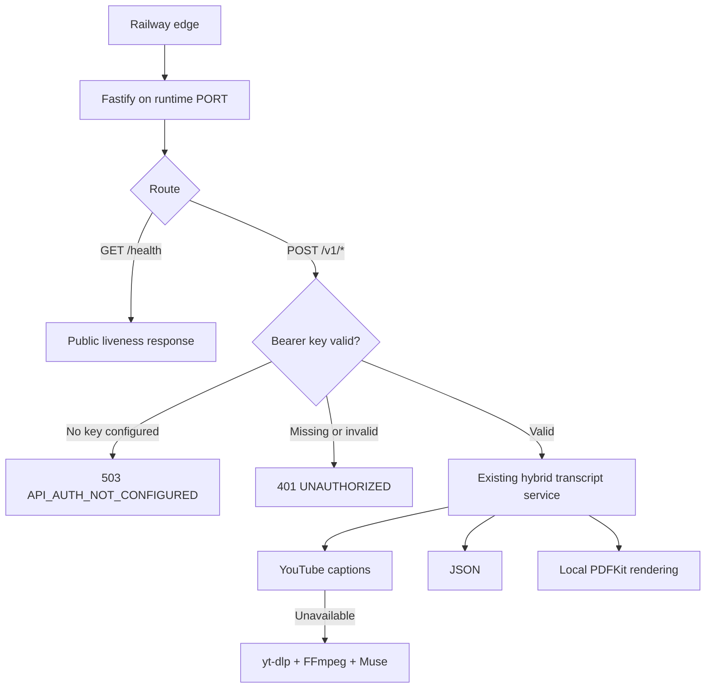

# Railway Production Deploy Design

**Spec:** `.specs/features/railway-production-deploy/spec.md`
**Status:** Approved from the user's explicit deploy request and the documented fail-closed security default

---

## Architecture Choice

| Approach | Strength | Cost and risk |
| -------- | -------- | ------------- |
| Railway private networking only | No public attack surface | Cannot be called by a local RAG workflow or service outside the Railway project. |
| Public Railway domain with Bearer token | Directly usable while protecting CPU and OpenCode quota | Requires one owner-managed secret and later rotation discipline. |
| Public Railway domain without authentication | Simplest caller setup | Anyone can trigger downloads, FFmpeg, and Muse quota; unsafe for this workload. |

The selected approach is a public Railway domain with a single Bearer token. The user explicitly
requested deployment; fail-closed access control is the safest reversible default for exposing this
quota-consuming API.

---

## Architecture Overview

Railway injects `PORT`, `OPENCODE_API_KEY`, and `API_ACCESS_KEY`. The application passes only the
two provider/runtime secrets into their owned boundaries. Authentication runs before schema parsing
or any transcript dependency, so unauthorized requests cannot create work.

---

## Code Reuse Analysis

### Existing Components to Leverage

| Existing component | Reuse |
| ------------------ | ----- |
| `loadConfig` optional-value normalization | Apply the same trimming to `API_ACCESS_KEY`. |
| `createApplication` composition root | Carry the access key to the HTTP boundary. |
| Fastify hooks and structured error envelopes | Add route-scoped authentication without changing transcript handlers. |
| Fastify `inject` integration suite | Prove auth short-circuits dependencies and preserves valid requests. |
| Multi-stage `Dockerfile` | Keep Node, FFmpeg, `yt-dlp`, non-root user, and compiled runtime. |
| Public `/health` | Reuse for both Railway deployment health and external smoke testing. |

### Integration Points

| System | Integration method |
| ------ | ------------------ |
| Railway build | `railway.json` selects the checked-in Dockerfile. |
| Railway health | `deploy.healthcheckPath: /health`; container health reads runtime `PORT`. |
| Railway secrets | CLI `variable set --stdin` for `OPENCODE_API_KEY` and generated `API_ACCESS_KEY`. |
| Railway networking | One Railway-provided public domain scoped to the deployed service. |
| Deployment evidence | Scoped CLI deployment/config reads and bounded `curl` smoke tests. |

---

## Components

### Runtime security configuration

- **Purpose:** Load and carry `API_ACCESS_KEY` without exposing it through the request contract.
- **Location:** `src/config.ts`, `src/app.ts`, `.env.example`.
- **Interface:** `ApplicationConfig.apiAccessKey?: string`.
- **Failure behavior:** A missing value remains explicit so the HTTP boundary can fail closed.

### Bearer authentication hook

- **Purpose:** Short-circuit protected routes before validation or expensive work.
- **Location:** `src/http/app.ts`.
- **Behavior:** Parse exactly one Bearer credential; treat the scheme case-insensitively; compare
  the credential to the configured value; return stable 401/503 envelopes.
- **Security:** Do not attach header/token values to structured logs or errors.

### Railway-aware container

- **Purpose:** Probe the same port that Fastify receives at runtime.
- **Location:** `Dockerfile`.
- **Behavior:** The Node health command reads `process.env.PORT`, falling back to 3000 locally.

### Railway service config

- **Purpose:** Make build/deploy behavior reviewable and repeatable.
- **Location:** `railway.json`.
- **Behavior:** Dockerfile builder, `/health`, 300-second health timeout, and bounded on-failure
  restart policy.

### Deployment operation

- **Purpose:** Create/link the Railway service, set variables, deploy, generate a domain, and smoke
  test the public contract.
- **Location:** Railway external state plus spec validation evidence.
- **Security:** Secrets enter CLI through stdin and never appear in stored evidence.

---

## Error Handling Strategy

| Scenario | Handling | User impact |
| -------- | -------- | ----------- |
| Access key not configured | Stop in authentication hook before route logic | HTTP 503 `API_AUTH_NOT_CONFIGURED`. |
| Header missing, malformed, or wrong | Stop in authentication hook | HTTP 401 `UNAUTHORIZED` plus Bearer challenge. |
| Valid key, invalid body | Continue into existing schema validation | Existing HTTP 400 `INVALID_REQUEST`. |
| Railway build/deploy fails | Inspect bounded build/deploy logs | Failure reported; never labeled successful. |
| Health check fails | Keep deployment non-successful and inspect runtime logs | No domain success claim. |
| YouTube blocks datacenter IP | Separate provider smoke failure from platform health/auth | Deployment may be healthy but provider path is reported degraded. |

---

## Risks & Concerns

| Concern | Impact | Mitigation in this feature | Follow-up |
| ------- | ------ | -------------------------- | --------- |
| Leaked owner token | Unauthorized quota usage | High-entropy Railway variable; never log/header-echo it | Rotation and multiple client tokens. |
| Unlimited valid-client concurrency | Memory/CPU/quota exhaustion | Not solved by single-token auth | `IMP-01`. |
| Hanging `yt-dlp` or FFmpeg | Worker and temp resource leak | Existing cleanup runs after process completion only | `IMP-02`. |
| Long synchronous videos | Railway/client timeout | Document current limitation | `IMP-03`. |
| Duplicate video requests | Repeated Muse use | No retry remains in place | `IMP-04`. |
| Opaque provider failures | Harder incident response | Existing typed public errors and bounded logs | `IMP-05`, `IMP-06`. |
| YouTube datacenter blocking | Caption/audio requests may fail from Railway | Preserve distinct provider errors; verify live | `IMP-09`. |

---

## Tech Decisions

| Decision | Choice | Rationale |
| -------- | ------ | --------- |
| HTTP auth | Standard Bearer header | Works with curl, agents, proxies, and future client SDKs. |
| Auth storage | Railway service variable | Avoids Git and image-layer secrets. |
| Health route | Public liveness-only endpoint | Compatible with Railway probes and does not call dependencies. |
| Builder | Dockerfile | Required media executables are already packaged and pinned. |
| Deployment config | Checked-in `railway.json` | Reviewable source of truth for health and restart behavior. |
| Tests | Existing Vitest unit + Fastify integration suites | Maintains network-isolated deterministic coverage. |
