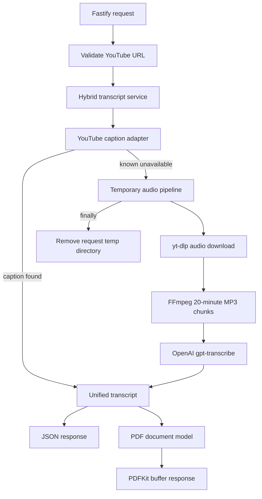

# Hybrid YouTube Transcript PDF API Design

**Spec**: `.specs/features/youtube-transcript-pdf/spec.md`
**Status**: Approved by the user's explicit hybrid-flow selection

---

## Architecture Choice

Three approaches satisfy the transcript goal:

| Approach | Strength | Cost and risk |
| -------- | -------- | ------------- |
| Captions only | Fast, free, preserves accurate caption timestamps | Fails for videos without usable captions and can be blocked on datacenter IPs. |
| OpenAI only | Consistent provider and works without captions | Downloads every video's audio, increases latency, and charges for work that captions already provide. |
| Captions with OpenAI fallback | Preserves the free fast path and covers captionless videos | Requires `yt-dlp`, FFmpeg, temporary files, and explicit billing configuration. |

The selected approach is captions with OpenAI fallback. The user explicitly confirmed this flow. The system keeps providers behind interfaces so failures and future replacements do not change the HTTP contract.

---

## Architecture Overview



The HTTP layer parses the URL before invoking any provider. `HybridTranscriptService` owns the one billable transition: only a typed captions-unavailable result reaches the audio fallback. All external calls use adapters. Tests inject fakes and never reach the network or local executables.

---

## Code Reuse Analysis

### Existing Components to Leverage

The repository contains only specification artifacts. There is no application code to reuse.

### Integration Points

| System | Integration Method |
| ------ | ------------------ |
| YouTube captions | `@hallelx/youtube-transcript` through `CaptionProvider`. |
| YouTube audio | `yt-dlp` child process with an argument array and no shell. |
| Audio chunking | FFmpeg child process producing mono 16 kHz MP3 segments. |
| OpenAI | Official Node SDK `audio.transcriptions.create` with `gpt-transcribe`. |
| PDF | PDFKit writes a buffer from a provider-neutral document model. |

---

## Components

### Domain contracts and errors

- **Purpose**: Define provider-neutral transcripts and stable application errors.
- **Location**: `src/domain/`
- **Interfaces**:
  - `TranscriptProvider.fetch(input): Promise<Transcript>`
  - `AudioFallback.transcribe(input): Promise<Transcript>`
  - `AppError(code, statusCode, message, cause?)`
- **Dependencies**: None.
- **Reuses**: None; this is the project boundary used by all adapters.

### YouTube URL parser

- **Purpose**: Accept only supported HTTPS YouTube hosts and extract an exact 11-character video ID.
- **Location**: `src/domain/youtube-url.ts`
- **Interfaces**:
  - `parseYouTubeUrl(value: string): ParsedYouTubeUrl`
- **Dependencies**: Node `URL`.
- **Reuses**: `AppError` for `INVALID_YOUTUBE_URL`.

### Caption provider

- **Purpose**: Fetch caption segments and translate library errors into domain outcomes.
- **Location**: `src/infrastructure/youtube/`
- **Interfaces**:
  - `YouTubeCaptionProvider.fetch(videoId, languages): Promise<Transcript>`
- **Dependencies**: `@hallelx/youtube-transcript`.
- **Reuses**: Domain contracts and typed errors.

### Process runner and audio media pipeline

- **Purpose**: Download audio and create bounded transcription chunks without shell interpretation.
- **Location**: `src/infrastructure/audio/`
- **Interfaces**:
  - `ProcessRunner.run(command, args): Promise<void>`
  - `AudioMediaPipeline.withChunks(sourceUrl, callback): Promise<T>`
- **Dependencies**: Node child processes, filesystem, OS temporary directory, `yt-dlp`, FFmpeg.
- **Reuses**: `AppError` and exact canonical URLs from the URL parser.

The pipeline creates a directory with `mkdtemp`, downloads one audio-only source, re-encodes it as `chunk-%03d.mp3`, validates every chunk at 24 MB or less, passes ordered paths to the callback, and recursively removes only the created directory in `finally`.

### OpenAI transcriber

- **Purpose**: Transcribe ordered chunks and convert them into provider-neutral chunk segments.
- **Location**: `src/infrastructure/openai/`
- **Interfaces**:
  - `OpenAiAudioTranscriber.transcribeChunks(paths, languages): Promise<TranscriptSegment[]>`
- **Dependencies**: Official `openai` Node SDK and file streams.
- **Reuses**: Audio chunk ordering and domain transcript types.

### Audio fallback

- **Purpose**: Compose the media pipeline and OpenAI transcriber behind one fallback interface.
- **Location**: `src/infrastructure/audio/`
- **Interfaces**:
  - `OpenAiAudioFallback.transcribe(input): Promise<Transcript>`
- **Dependencies**: `AudioMediaPipeline`, `OpenAiAudioTranscriber`, optional API key configuration.
- **Reuses**: Domain result construction.

### Hybrid transcript service

- **Purpose**: Select the free caption path first and the billable fallback only for typed caption unavailability.
- **Location**: `src/application/hybrid-transcript-service.ts`
- **Interfaces**:
  - `getTranscript(parsedUrl, languages): Promise<Transcript>`
- **Dependencies**: `CaptionProvider`, optional `AudioFallback`, clock.
- **Reuses**: Domain errors and text normalization.

### PDF document model and renderer

- **Purpose**: Build source-independent metadata and timestamped paragraphs, then render a searchable PDF.
- **Location**: `src/infrastructure/pdf/`
- **Interfaces**:
  - `buildPdfModel(transcript): PdfDocumentModel`
  - `renderTranscriptPdf(model): Promise<Buffer>`
- **Dependencies**: PDFKit.
- **Reuses**: Unified transcript model.

### Fastify application

- **Purpose**: Validate input, expose health/JSON/PDF routes, map `AppError`, and log safe metadata.
- **Location**: `src/http/` and `src/app.ts`
- **Interfaces**:
  - `buildApp(dependencies, options?): FastifyInstance`
- **Dependencies**: Fastify and application services.
- **Reuses**: JSON Schema, unified transcript, and PDF renderer.

---

## Data Models

### Transcript

```typescript
type TranscriptSource = 'youtube_captions' | 'openai_transcription'
type TimestampPrecision = 'caption' | 'chunk'

interface TranscriptSegment {
  text: string
  startSeconds: number
  durationSeconds: number | null
}

interface Transcript {
  videoId: string
  sourceUrl: string
  source: TranscriptSource
  language: string
  isGenerated: boolean
  timestampPrecision: TimestampPrecision
  extractedAt: string
  text: string
  segments: TranscriptSegment[]
}
```

### Transcript request

```typescript
interface TranscriptRequest {
  url: string
  languages?: string[]
}
```

`languages` contains one to five non-empty language codes. Fastify rejects unknown body fields.

### PDF document model

```typescript
interface PdfDocumentModel {
  title: string
  metadata: Array<{ label: string; value: string }>
  paragraphs: Array<{ timestamp: string; text: string }>
}
```

Each paragraph is at most 1,500 characters. Segment text is appended once and in order.

---

## Error Handling Strategy

| Error scenario | Handling | User impact |
| -------------- | -------- | ----------- |
| Invalid or unsafe URL | Reject before providers | HTTP 400 `INVALID_YOUTUBE_URL`. |
| Caption language absent or captions disabled | Enter audio fallback | No error when fallback succeeds. |
| Empty caption result | Treat as unavailable | Enter audio fallback. |
| Video private, unavailable, or age-restricted | Do not incur OpenAI call | HTTP 404 `VIDEO_NOT_AVAILABLE`. |
| Caption provider changed or network failed unexpectedly | Do not incur OpenAI call | HTTP 502 `YOUTUBE_UPSTREAM_ERROR`. |
| API key absent on fallback | Stop before media work | HTTP 503 `AUDIO_FALLBACK_NOT_CONFIGURED`. |
| Executable missing | Translate process spawn `ENOENT` | HTTP 503 `AUDIO_TOOL_UNAVAILABLE`. |
| Download or FFmpeg non-zero exit | Clean temporary files | HTTP 502 `AUDIO_EXTRACTION_FAILED`. |
| Chunk larger than 24 MB | Stop before OpenAI | HTTP 502 `AUDIO_CHUNK_TOO_LARGE`. |
| OpenAI request fails | Clean temporary files | HTTP 502 `OPENAI_TRANSCRIPTION_FAILED`. |
| PDF render fails | Return typed server error | HTTP 500 `PDF_GENERATION_FAILED`. |

---

## Risks & Concerns

| Concern | Location | Impact | Mitigation |
| ------- | -------- | ------ | ---------- |
| Unofficial YouTube caption endpoint changes or blocks datacenter IPs | `src/infrastructure/youtube/` | Captions may fail in production. | Keep the provider replaceable; fall back only on known unavailable/block cases and document proxy support as deferred. |
| Audio download also depends on YouTube behavior | `src/infrastructure/audio/` | Fallback can fail independently. | Emit separate typed errors and keep `yt-dlp` current in the image. |
| Subprocess command injection | `src/infrastructure/audio/` | Untrusted URL could become a shell command. | Parse to an exact video ID, rebuild the canonical URL, use `spawn` with `shell: false`, and pass an argument array. |
| Media files contain copyrighted or sensitive content | temporary directory | Retention creates privacy and storage risk. | Use request-scoped `mkdtemp` directories and mandatory `finally` cleanup. |
| OpenAI cost amplification | `src/application/hybrid-transcript-service.ts` | Unexpected caption errors could trigger paid work. | Only `CaptionsUnavailableError` enters fallback; no automatic retries. |
| OpenAI upload limit | `src/infrastructure/audio/` | Long or high-bitrate content may be rejected. | Re-encode to 48 kbps mono MP3, split every 20 minutes, and enforce a 24 MB preflight limit. |
| PDF built-in fonts have limited glyph coverage | `src/infrastructure/pdf/` | Some emoji or non-Latin symbols may not render. | Scope guarantees Brazilian Portuguese diacritics; retain original Unicode in JSON and document broader font embedding as deferred. |
| Empty repository has no established quality conventions | project-wide | New patterns could be inconsistent. | Use strict TypeScript, Biome, Vitest, Fastify injection tests, and strong-default AC coverage. |

---

## Tech Decisions

| Decision | Choice | Rationale |
| -------- | ------ | --------- |
| Runtime | Node.js 22 or newer, TypeScript ESM | The current OpenAI Node SDK requires Node.js 22+. |
| Validation | Fastify JSON Schema with explicit TypeScript request types | Avoids another runtime validation dependency. |
| Formatting and linting | Biome | Supports current TypeScript without the parser-version mismatch in ESLint tooling. |
| Tests | Vitest unit tests plus Fastify `inject` integration tests | Tests remain network- and subprocess-isolated. |
| Media tools | System `yt-dlp` and FFmpeg, installed in Docker | Avoids downloading executable code during requests. |
| Audio format | 48 kbps mono 16 kHz MP3, 20-minute segments | Keeps speech uploads far below 25 MB with useful ASR quality. |
| Transcript model | `gpt-transcribe` | Current OpenAI guidance recommends it for recorded speech in the original language. |
| PDF | PDFKit buffer response | Produces searchable text and works with Fastify buffers. |
